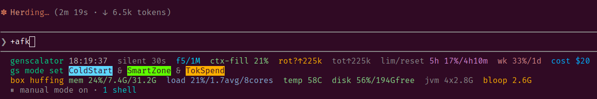
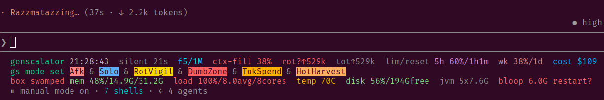

# HUMANS.md — the deeper README

> This is a counterpart to [`AGENTS.md`](AGENTS.md): that file is *for the agent(s)*, this one is *for humans* that want to understand the deeper idea behind genscalator and the structure of this repo.
> **New here?** Start with [README.md](README.md) and then read "Where are all the things?" below.
> Contributions are welcome! Information on how to contribute lives in [`CONTRIBUTING.md`](CONTRIBUTING.md).

## 1. Where are all the things?

Every top-level entry, what it is for, and where to read more:

| Where | What |
|-------|------|
| [`README.md`](README.md) | what genscalator is, install, quickstart. The first screen. |
| [`HUMANS.md`](HUMANS.md) | this file: the deeper idea and the repo map. |
| [`AGENTS.md`](AGENTS.md) | the operating contract the *agent* reads: conventions, tool selection, workflow habits. |
| [`CONTRIBUTING.md`](CONTRIBUTING.md) | how to contribute: issues (in-repo!), pull requests, new tools. |
| [`SECURITY-MODEL.md`](SECURITY-MODEL.md) | the threat model and why the safe-by-design choices look the way they do. |
| [`CHANGELOG.md`](CHANGELOG.md) | the shipped history, release by release. |
| [`tools/`](tools/README.md) | the typed `tt` toolbox: one Scala file per tool, plus the `tt` launcher and the test suite (`tools/test/`). |
| [`skills/`](skills/) | the Claude Code skills the plugin ships (the toolbox habit, Scala style, code review, reqT-lang, the app seed, ...). |
| [`docs/`](docs/) | human-facing documentation: [`foundations.md`](docs/foundations.md) (goals, stakeholders, the full glossary), the `gs`-command registry, manuals for the status line and releasing, and `docs/generated/` for generated output (the API docs are built locally by `deploy/deployttapi.sc` and are not tracked). |
| [`reqts/`](reqts/) | the requirements side: [`PRD.md`](reqts/PRD.md) (the Product Requirements Document in reqT-lang) and [`issues/`](reqts/issues/README.md) (issues live *in the repo*; the forge trackers are just an inbox, see CONTRIBUTING.md). |
| [`deploy/`](deploy/) | everything that ships things *out* of the repo: the blog/site deployer, the API-docs generator, the mirror script, server config snippets. |
| [`media/`](media/) | publishable material: [`blog/`](media/blog/), podcast drafts, images, and the design language that generates the site's look. |
| [`research/`](research/) | the open action-research substrate: numbered research notes, `wr-data/` (workflow-research field data, logged live), and case studies. Raw and honest by design; findings graduate into blog posts. |
| [`work/`](work/) | tracked working state: [`NOW.md`](work/NOW.md) (the current in-flight state of development, committed so its history is git's) and the warp-ember templates (how a session hands off to the next). |
| [`bin/`](bin/) | a thin launcher shim (`bin/tt`) for installs that want the launcher outside `tools/`. |
| [`.claude-plugin/`](.claude-plugin/) | the Claude Code plugin + marketplace manifests (name, version). |

## 2. Important terminology

The full glossary lives in [`docs/foundations.md`](docs/foundations.md); these one-liners are just enough to read this repo's documents, each pointing there for depth:

| Term | Meaning |
|------|---------|
| **typed tool** | a small, self-contained, compiler-checked Scala program run as `tt <tool> <args>`; the safe replacement for one-off bash/grep/awk. |
| **cue** | a short standing signal between human and agent ("go", "hang on", "WDYT") with an agreed meaning, so communication stays fast and unambiguous. |
| **dance** | a small named micro-workflow the pair performs together (the compact dance, the delegation dance); dances compose into bigger workflows. |
| **smart zone / dumb zone** | the context-fill range where the agent's judgment is sharp, versus past the ceiling where quality degrades (*context rot*). |
| **warp ember** | the banked coal a session leaves at exit so the next cold-started agent can blow the context back into flame (templates in `work/`). |

## 3. The main goals of genscalator

The one-line version of the three goals in the README:

* **Smarter** — keep the joint human-agent work inside the smart zone by making state visible (the awareness lines) and workflows deliberate (cues and dances).
* **Safer** — replace dynamic shell blobs with typed, compiled, allowlistable tools, so fewer dangerous approvals are needed at all and the human's attention is spent where it matters.
* **Faster** — make the joint workflow composable and low-friction, and (roadmap) compile hot tools to native binaries for instant start-up.

Out-of-the-box agent workflows lean on approving dense bash compounds and archaic Unix tools 
stitched together in a difficult-to-review blob. 
Much of the guardrail machinery exists precisely to contain what can go wrong there, and the cost is **confirmation fatigue** and bad UX from reviewing cryptic, dynamic, unsafe code. Your agent can be **smarter** if you give it more powerful tools.

With genscalator your human-agent workflows shift to **safe, compiled code with static guarantees**. Every time the agent would reach for a
one-off bash/grep/awk helper, it instead creates (or reuses) a persistent, self-contained Scala tool.
That earns static guarantees, reduces the agent getting stuck debugging brittle helpers, and shrinks the
number of dangerous operations that need human approval at all.

With the genscalator plugin installed and the native tools activated (a roadmap item, see the Faster goal above) you move to **fast** startup of compiled and audited Scala tools at your agents' fingertips.

## 4. Why workflows, why not just typed tools?

In the genscalator research project we have the hypothesis (perhaps plausible when you think of it) that an escalation of the joint human-agent productivity in agentic software engineering relies on *mutual awareness* of each other's state-of-mind plus a set of workflow "atoms", in genscalator called "cues" and "dances". Their aim is to help make communication efficient and unambiguous. Dances serve as micro-workflows that can be composed into bigger macro-workflows for each unique human-agent pair to create and build on.

> Workflows are **opt-in**: you decide when to adopt available cues and dances and how to compose them. Genscalator makes them available to agents in their hot context and to the fingertips of the human at the keyboard.

## 5. The bigger picture

Genscalator is also a research project into agentic software engineering workflow productivity. The invention of typed tools is supported by a dog-fooding action research approach where genscalator is used in meta-level experiments and case studies on human-agent workflows. Emerging research questions and findings are reported in [`media/blog/`](https://bjornregnell.se/genscalator/blog) and research studies are brainstormed, designed and executed in [`research/`](research/), as we go, supported by the genscalator typed tools and joint human-agent workflow under development.

## 6. The scope of genscalator

### In scope: personal Agentic Software Engineering (ASE)

Genscalator focuses on the personal Agentic Software Engineering (ASE) process. It is the joint human-agent collaboration productivity escalation that is the main objective.

### Out of scope for now: team- and organization-level ASE

We leave the organisational aspects of Agentic Software Engineering (ASE) for later, as it is currently difficult to do live action research in a real software engineering organization, with all the business-impacting caveats of doing so. But if an organization is willing to research the on-the-fly implementation of productive team-level and organization-wide agentic software engineering with genscalator, this may become feasible at a later time.

TODO: add some cred/connection to Watts Humphrey's PSP (never widely succeeded because it is SO boring for humans to fill in all those tables; but agents do not get bored...)

### The extended genscalator action research endeavour

TODO

## 7. The genscalator awareness lines

  

The above image shows the genscalator awareness lines:

* The first line is the *introspection line* with important measured data and metrics. The second line is the *mode line* with the currently declared joint human-agent modes. The third line is the *box line* with the measured health of the machine itself.
* In this session the agent has just been warp-started cold: the hand-off note (in genscalator called a *warp ember* — the banked coal a session leaves so the next agent can blow the context back into flame) told the fresh agent to declare `ColdStart` (fresh process, not yet re-calibrated) and `SmartZone` (a fresh context window, low fill, sharp judgment), while `TokSpend` says the pair has token headroom to spend.
* Context-fill is low (5%), and the box line already hints at trouble ahead: the compile server is growing (`bloop 3.2G`) and the box is `huffing`.

  

The above image shows the same awareness lines three hours later, in a critical moment:

* The human is away from keyboard and the agent is doing solo jobs (`Afk` and `Solo` are declared), while trying to stay clear of harness guard-stalls. The agent runs a fleet of steerable sub-agents (in genscalator called *minions* if the super-agent can dynamically chat with them or put them on hold with a hot context) - the harness chrome at the bottom shows 7 shells and 4 agents.
* The session has been going on for a while, with many messages from the human and over half a million tokens generated by the agent (`rot?↑529k`). The agent has declared `RotVigil` (rot-vigilance: extra care with mechanical edits, commit and push after every unit) and, based on its own measured slip rate that evening, `DumbZone` - the agent itself putting on record that its judgment is degrading. `HotHarvest` means it is busy harvesting still-hot insights into durable notes before the session ends.
* The *box line* shows the machine itself struggling: `box swamped`, all cores busy at `load 100%`, and the compile server at `bloop 6.0G` where the line adds its built-in advice: `restart?`. (Honesty note: the CPU load in this shot came from a deliberate, bounded stress test staged for this figure; the token counts, modes, memory and bloop figures are the session's real, measured state.)

Read the full manual for all three lines in [`docs/statusline-manual.md`](docs/statusline-manual.md).
