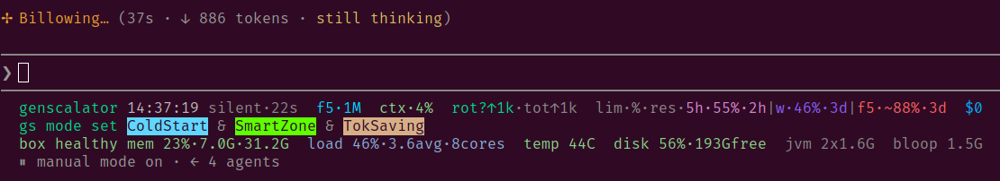

# genscalator.ai

## *Power tools for agents and humans: smarter, safer, faster.*

<p align="center">
  
</p>

The above image shows the genscalator awareness lines. Read more about what they mean in [HUMANS.md, "The genscalator awareness lines"](HUMANS.md#7-the-genscalator-awareness-lines).

What do we mean by 
* **smarter?** By introspection, genscalator tries to stay in the smart zone, aiming to stay away from the dumb zone and decrease the probability of agent mistakes.
* **safer?** By open, inspectable, compile-time checked strongly typed tools genscalator avoids harness guard stalls that ask for permission, with the aim to reduce human confirmation fatigue.
* **faster?** With defined workflow elements (cues and dances) genscalator aims to provide composable efficient joint human-agent workflows. Also, the typed tools can be compiled to bare metal for ~0.03 s start-up times (see [Graalify](#34-graalify-genscalator-for-speed-and-low-footprint)); the planned `gs native` command (roadmap) will check what you have on your box and help you set this up with consent.

You can read more on the background and goals of genscalator in [HUMANS.md](HUMANS.md#3-the-main-goals-of-genscalator) and navigate the structure of this repo by reading ["Where are all the things?" in HUMANS.md](HUMANS.md#1-where-are-all-the-things).

This README.md focuses on a brief overview of genscalator and how to get started.

**Contents**

* [1. What is genscalator?](#1-what-is-genscalator)
* [2. How to install genscalator](#2-how-to-install-genscalator)
  * [2.1 Install the genscalator Claude Code plugin](#21-install-the-genscalator-claude-code-plugin)
  * [2.2 Companions for Scala code (recommended)](#22-companions-for-scala-code-recommended)
  * [2.3 Manual install](#23-manual-install-recommended-if-you-dont-use-claude-code)
* [3. Using the Claude Code plugin](#3-using-the-claude-code-plugin)
  * [3.1 What you get](#31-what-you-get)
  * [3.2 The gs in-session commands](#32-the-gs-in-session-commands)
  * [3.3 Getting started: seed a working web app](#33-getting-started-try-seeding-a-working-web-app)
  * [3.4 Graalify for speed and low footprint](#34-graalify-genscalator-for-speed-and-low-footprint)
* [4. Using typed tools directly in terminal](#4-using-typed-tools-directly-in-terminal)
  * [4.1 Tool dependencies](#41-tool-dependencies)
  * [4.2 Optional: forge tokens for tt forge](#42-optional-forge-tokens-for-tt-forge-github-and-codeberg)
* [5. Licenses](#5-licenses) · [6. Donations](#6-donations) · [7. Commercial support](#7-commercial-support) · [8. Mirrors and digital sovereignty](#8-mirrors-and-digital-sovereignty)

## 1. What is genscalator?

Genscalator is a toolbox and a set of workflows for Agentic Software Engineering (ASE) that replaces the brittle
bash/grep/awk/python reflex with **typed, compiler-checked, reusable Scala tools**. 

* Your agent automatically picks a tool when needed and gives it the right
args. No re-deriving logic each time, no dynamic-shell surprises. 

* The Scala compiler catches mistakes by agents before
they run, and a small underlying launcher (`tt`) that the agent uses makes every tool a single, statically-analyzable command that a
narrow allowlist can trust. 

* The Scala compiler's error messages, all seen and interpreted by the agent, will help the agent to recover from mistakes before going into dynamic debugging.

The tools and workflows are *language-agnostic*. With genscalator you can generate and manage code in **any language**.

When you generate **Scala**, you get extra help from the bundled Scala skills (`scala-style` for the common style,
`scala-code-review`, `reqt-lang`) and the optional [Scala-code companions](#22-companions-for-scala-code-recommended)
(scalex, Metals MCP).


## 2. How to install genscalator

* **Prerequisites:** [scala-cli](https://scala-cli.virtuslab.org/install) and a JDK (to run the tools), plus `git`
(to clone this repo).

* **Platforms:** Linux, macOS, and WSL (Windows Subsystem for Linux) — anywhere `bash` + `scala-cli` run. On native Windows, use WSL or Git Bash.

### 2.1 Install the genscalator Claude Code plugin

Make sure you have the prerequisites above. In Claude Code, run:
```
/plugin marketplace add bjornregnell/genscalator
/plugin install genscalator@bjornregnell
/reload-plugins
```
The short form installs from the GitHub mirror (kept in sync on every commit). The canonical
Codeberg repo works too: `/plugin marketplace add https://codeberg.org/bjornregnell/genscalator.git`

Then verify with **`/skills`** (you should see `tt-toolbox`,
`scala-style`, and the rest of the set). If the skills do not show up yet, restart Claude Code and check again. 

If you just type this in chat:
```
gs
```
you should see help on how to use genscalator's *do-what-I-mean* commands.

For the full skill set, the recommended allowlist, the `gs` commands, etc., see [Using the Claude Code plugin](#3-using-the-claude-code-plugin) further down.


**Allow the typed tools to run without a prompt.** When the Claude Code harness asks for permissions you can allow according to its suggestions. 

To set a more complete and precise allow-list, issue this *do-what-I-mean* command in the chat and you will get help from Claude:
```
gs allow
```

You can also edit the `.claude/settings.local.json` directly, for example:
```
{ "permissions": { "allow": ["Bash(tt *)", "Bash(scala-cli *)"] } }
```
to give the exact permissions you want.

### 2.2 Companions for Scala code (recommended)

genscalator integrates — but does **not** bundle — two upstream tools for Scala *code* intelligence (the
`tt` tools cover text and logs). Install whichever you need; [`docs/tool-selection.md`](docs/tool-selection.md)
says which tool answers which question.

- **[scalex](https://github.com/nguyenyou/scalex)** — fast, symbol-aware Scala navigation. On Claude Code:
  ```
  /plugin marketplace add nguyenyou/scalex
  /plugin install scalex@scalex-marketplace
  /reload-plugins
  ```
  For a standalone binary / other agents, see the upstream repo.
  
- **[Metals MCP](https://scalameta.org/metals/docs/features/mcp/)** — compiler-grade truth (inferred types,
  real diagnostics, run tests, refactor); heavier. Enable it through your editor's Metals + MCP-client
  config per the linked setup page.

### 2.3 Manual install (recommended if you don't use Claude Code)

> TODO. This is future work and not yet fully operational. In pre-releases we focus on Claude Code support.

**A. Clone the repo:**
```
git clone https://codeberg.org/bjornregnell/genscalator.git
cd genscalator
```

**B. Put the `tt` launcher on your PATH.** Run this *from the repo root* (so `$PWD` is your clone),
symlinking the launcher into a directory that's on your PATH:
```
ln -s "$PWD/tools/tt" ~/.local/bin/tt    # ensure ~/.local/bin is on your PATH
```
The typed-tools launcher is one literal, allowlist-friendly command from any repo. First run of a tool
compiles (a couple of seconds); reruns are cached. Verify with `tt files src .scala --count`.

## 3. Using the Claude Code plugin

You installed the plugin in [How to install genscalator](#2-how-to-install-genscalator); here is what it gives
you and how to drive it. Details, the recommended allowlist, and caveats: [`docs/claude-plugin.md`](docs/claude-plugin.md).

### 3.1 What you get

Installing the plugin puts the `tt` toolbox on your PATH for the agents to use when the genscalator plugin is active (see [Usage](#4-using-typed-tools-directly-in-terminal)) and adds a set of **skills** — focused
playbooks the agent invokes by name, or by matching what you ask for:

| Skill | What it does |
|-------|--------------|
| `tt-toolbox` | how to use and choose the `tt` tools — the toolbox habit |
| `scala-style` | a genscalator-tailored guide on Scala generation in direct, [common style](https://codeberg.org/bjornregnell/scala-common-style) |
| `scala-code-review` | review Scala code for correctness, style, and safety |
| `reqt-lang` | write markdown requirements in reqT-lang, meta-examples in [`PRD.md`](reqts/PRD.md) |
| `crud-web-app-seed` | seed a complete, runnable web app into a directory you choose — see *Getting started* below |

The plugin also ships the operating contract [`AGENTS.md`](AGENTS.md) — the shared human-agent **conventions** (tool
selection, shorthand, workflow "dances", safe-by-design allowlist habit, etc.) that the agent reads as its
modus operandi. Full glossary and cues live in [`docs/foundations.md`](docs/foundations.md).

### 3.2 The `gs` in-session commands

Once the plugin is active you can drive genscalator by typing 
```
gs help
```
to the agent in chat. 

`gs` is a
**do-what-I-mean** cue: the agent matches your words to the nearest command in meaning (an informal list, not a rigid
syntax, so near-miss spellings and phrasings still work) and does it in the session.

You can get help with Claude Code settings for allow/deny/ask by issuing this command and following the instructions from the agent:

```
gs allow
```

### 3.3 Getting started: Try seeding a working web app

New to genscalator? The fastest way to see it work is to let the agent **seed a complete, runnable Scala web app** for
you, then run and read it. After installing the plugin, in a fresh context, ask in plain language, naming the directory you want, something similar to:

> Use the crud-web-app-seed skill to create a todo web app in ./my-todo

Or you can just type this gs command in the chat:
```
gs new app todo ./my-todo
```

The agent runs the **`crud-web-app-seed`** skill, which writes a small full-stack project into the directory you chose:
a shared datamodel, a **JDK-only** HTTP server, and a **Scala.js + Laminar** browser client, plus a Product Requirements Document in `PRD.md`, and a test suite. Then follow the agent's instructions or ask when you need help. The todo app is deliberately small and commented so you can read the whole thing and adapt it to your liking together with the agent that will invoke genscalator's typed tools when it sees fit.

### 3.4 Graalify genscalator for speed and low footprint

The whole `tt` toolbox can be compiled into **one native binary** (GraalVM native-image), and the
launcher then prefers it automatically. What you gain:

* **Speed**: a `tt` call starts in ~0.03 s instead of ~0.5 s on the JVM — agents issuing many small
  typed-tool calls feel this immediately (the full test suite drops from ~2 minutes to ~30 seconds).
* **Low footprint**: no compile server (bloop) and no warm JVM need to stay resident — the binary
  just runs, so a whole class of build-daemon stalls and memory drains disappears.

Build it once with the **rebuild ritual** (from the repo root, takes a few minutes and ~4 GB RAM):
```
scala-cli run deploy/buildnative.sc
```
The ritual never swaps in an unproven binary: it builds a candidate, runs the complete
CLI-contract test suite *through* that candidate, and only on all-green replaces the live binary
atomically. After any edit under `tools/` the launcher detects the binary is stale and safely
falls back to scala-cli (slower, never wrong) until you re-run the ritual. Opt out anytime with
`TT_NATIVE=0 tt ...`.

Status: proven on linux-x64; macOS/Windows binaries are on the roadmap. Details, measurements and
design: [`docs/native.md`](docs/native.md).

## 4. Using typed tools directly in terminal

After following the install instructions above to get `tt` on your PATH you can run the typed tools directly in terminal like so:

```
tt <tool> <args...>
```

Examples:

```
tt text count build.log '^! '          # count matches (grep -c)
tt text grepr src .scala 'TODO'        # recursive search → file:line:match
tt files src .scala --count            # count matching files (find|wc)
```

TODO: add and improve examples above.

Full cheat-sheet: [`tools/README.md`](tools/README.md).


### 4.1 Tool dependencies

Most `tt` tools need only **scala-cli + a JDK** — scala-cli fetches the Scala compiler and the small library set on
first run, then caches them (no manual library install). A few tools additionally shell out to an **external program**
for one job; install that only if you use the tool.

| Requirement | What / version | Install | Docs |
|------|----------------|---------|------|
| **`tt` runner + all tools** | • **Scala 3.8.4** compiler<br>• a **JDK 21+**<br>• run via **scala-cli** (it fetches the compiler)<br>• libraries — **auto-fetched by scala-cli**, cached: `os-lib` 0.11.8 · `ujson` 4.4.3 · `requests` 0.9.3 · `munit` 1.3.3 *(tests only)* | Install **scala-cli + a JDK** — see [Install](#2-how-to-install-genscalator); scala-cli fetches the compiler + libraries on first use. | [scala-cli](https://scala-cli.virtuslab.org/) · [Scala 3.8.4](https://www.scala-lang.org/download/) |
| **`tt gvdot`** *(optional)* | **graphviz** (`dot`) — lays out sequence diagrams to pdf/png/svg | `sudo apt install graphviz` (Debian/Ubuntu); `brew install graphviz` (macOS) | [graphviz.org](https://graphviz.org/) · `dot -h` · `man dot` |

Tools degrade gracefully when their dependency is missing: `tt gvdot` still prints DOT source without `dot`, and
errors with the install hint only on the render path. (The sibling renderers `tt svg` and `tt ascii` need **no**
external dependency — pure JDK.)

### 4.2 Optional: forge tokens for `tt forge` (GitHub and Codeberg)

`tt forge` talks to code forges (issues, PRs, releases, tags, branch protection) on Codeberg/Forgejo and,
via `--gh`, on GitHub. **All read verbs work without any token** — GitHub just rate-limits anonymous reads
(60/hour). A token is only needed for `protection` (admin-scoped read) and the release verbs. Tokens are
read **only from fixed environment variables** (never flags) and are only ever sent to their own forge's
fixed host.

- **GitHub (optional):** install [GitHub's `gh` CLI](https://cli.github.com/), authenticate once with
  `gh auth login`, then reuse its token by adding to your `~/.bashrc`:
  ```bash
  export GITHUB_TOKEN="$(gh auth token)"
  ```
  This lifts the anonymous rate limit and enables `tt forge protection <owner>/<repo> <branch> --gh`.
  No new secret to manage: revoking the `gh` login revokes this too.

- **Codeberg/Forgejo (optional):** mint a token in Codeberg → Settings → Applications
  ([how-to in the Codeberg docs](https://docs.codeberg.org/advanced/access-token/)) (scope
  `read:repository`, plus `write:repository` if you will create releases) and add to your `~/.bashrc`:
  ```bash
  export CODEBERG_TOKEN="<your token>"
  ```
  (Each forge also honours a genscalator-specific name checked first — `GENSCALATOR_CODEBERG_TOKEN`
  respectively `GENSCALATOR_GITHUB_TOKEN` — if you want a token dedicated to these tools.)

- **GitLab:** no token to set — `tt forge` has no GitLab dialect (yet), so nothing reads a GitLab
  token; git-level mirroring to GitLab needs no API token.

Putting the exports in `~/.bashrc` makes them reach both your own terminals and the shells your agent
spawns (note that a running agent session keeps its start-time environment; restart the session after
adding them). Full verb reference: [`tools/README.md`](tools/README.md).


## 5. Licenses

* All code in this repo is licensed under Apache-2.0 — see [`LICENSE`](LICENSE).
* All blog posts and research topics are licensed as CC-BY 4.0.

## 6. Donations

Genscalator is developed as a liberally licensed open source software project that anyone can use. If you want to support the maintenance and implementation of new features of genscalator contact genscalator@bjornregnell.se

## 7. Commercial Support

* For commercial support and consultancy in using genscalator to improve agentic software engineering productivity contact genscalator@bjornregnell.se


## 8. Mirrors and digital sovereignty

The genscalator repo is mirrored from [Codeberg](https://codeberg.org/bjornregnell/genscalator) to [GitHub (owned by Microsoft)](https://github.com/bjornregnell/genscalator), [GitLab](https://gitlab.com/bjornregnell/genscalator) and LTH coursegit (Lund University internal, login required) in the spirit of [digital sovereignty](https://en.wikipedia.org/wiki/Digital_sovereignty). See also [here](https://codeberg.org/bjornregnell/digital-sovereignty).

