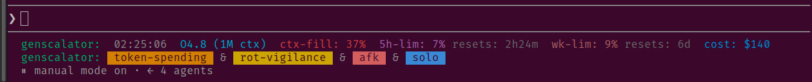

# genscalator

**Power tools for agents: smarter, safer, faster.**

<p align="center">
  
</p>

## 1. What is genscalator?

Genscalator is a toolbox + workflow for coding agents that replaces the brittle
bash/grep/awk/python reflex with **typed, compiler-checked, reusable Scala tools**. 

* Your agent automatically picks a tool when needed and gives it the right
args. No re-deriving logic each time, no dynamic-shell surprises. 

* The Scala compiler catches mistakes by agents before
they run, and a small underlying launcher (`tt`) that the agent uses makes every tool a single, statically-analyzable command that a
narrow allowlist can trust. 

* The Scala compiler's error messages, all seen and interpreted by the agent, will help the agent to recover from mistakes before going into dynamic debugging.

The tools and workflow are *language-agnostic*. With genscalator you can generate and manage code in **any language**.

When you generate **Scala**, you get extra help from the bundled Scala skills (`scala-style` for the common style,
`scala-code-review`, `reqt-lang`) and the optional [Scala-code companions](#22-companions-for-scala-code-recommended)
(scalex, Metals MCP).

## 2. How to install genscalator

* **Prerequisites:** [scala-cli](https://scala-cli.virtuslab.org/install) and a JDK (to run the tools), plus `git`
(to clone this repo).

* **Platforms:** Linux, macOS, and WSL (Windows Subsystem for Linux) — anywhere `bash` + `scala-cli` run. On native Windows, use WSL or Git Bash.

### 2.1 Install the genscalator Claude Code plugin

Make sure you have the prerequisites above. In Claude Code, run:
```
/plugin marketplace add https://codeberg.org/bjornregnell/genscalator.git
/plugin install genscalator@bjornregnell
/reload-plugins
```
Then verify with **`/skills`** (you should see `tt-toolbox`,
`scala-style`, and the rest of the set). If the skills do not show up yet, restart Claude Code and check again. 

If you just type this in chat:
```
gs
```
you should see help on how to use the genscalator's *do-what-I-mean* commands.

For the full skill set, the recommended allowlist, the `gs` commands, etc., see [Using the Claude Code plugin](#4-using-the-claude-code-plugin) further down.


**Allow the typed tools to run without a prompt.** When the Claude Code harness asks for permissions you can allow according to its suggestions. 

To set a more complete and precise allow-list, issue this *do-what-I-mean* command in the chat and you will get help from Claude:
```
gs allow
```

You can also edit the `.claude/settings.local.json` directly, for example:
```
{ "permissions": { "allow": ["Bash(tt *)", "Bash(scala-cli *)"] } }
```
to give the exact permissions you want.

### 2.2 Companions for Scala code (recommended)

genscalator integrates — but does **not** bundle — two upstream tools for Scala *code* intelligence (the
`tt` tools cover text and logs). Install whichever you need; [`docs/tool-selection.md`](docs/tool-selection.md)
says which tool answers which question.

- **[scalex](https://github.com/nguyenyou/scalex)** — fast, symbol-aware Scala navigation. On Claude Code:
  ```
  /plugin marketplace add nguyenyou/scalex
  /plugin install scalex@scalex-marketplace
  /reload-plugins
  ```
  For a standalone binary / other agents, see the upstream repo.
  
- **[Metals MCP](https://scalameta.org/metals/docs/features/mcp/)** — compiler-grade truth (inferred types,
  real diagnostics, run tests, refactor); heavier. Enable it through your editor's Metals + MCP-client
  config per the linked setup page.

### 2.3 Manual install (recommended if you don't use Claude Code)

> TODO. This is future work and not yet fully operational. In pre-releases we focus on Claude Code support.

**A. Clone the repo:**
```
git clone https://codeberg.org/bjornregnell/genscalator.git
cd genscalator
```

**B. Put the `tt` launcher on your PATH.** Run this *from the repo root* (so `$PWD` is your clone),
symlinking the launcher into a directory that's on your PATH:
```
ln -s "$PWD/tools/tt" ~/.local/bin/tt    # ensure ~/.local/bin is on your PATH
```
The typed-tools launcher is one literal, allowlist-friendly command from any repo. First run of a tool
compiles (a couple of seconds); reruns are cached. Verify with `tt files src .scala --count`.

## 3. Why genscalator?

Out-of-the-box agent workflows lean on approving dense bash compounds and archaic Unix tools 
stitched together in a difficult to review blob. 
Much of the guardrail machinery exists precisely to contain what can go wrong there, and the 
cost is **confirmation fatigue** and bad UX from reviewing cryptic, dynamic, unsafe code.

Genscalator shifts to **safe, compiled code with static guarantees**. Every time the agent would reach for a
one-off bash/grep/awk helper, it instead creates (or reuses) a persistent, self-contained Scala tool.
That earns static guarantees, reduces the agent getting stuck debugging brittle helpers, and shrinks the
number of dangerous operations that need human approval at all.

See [`docs/foundations.md`](docs/foundations.md) for the full goals, stakeholders (human / agent / Black
Hat Hacker threat model), and glossary.

### 3.1 The bigger picture

Genscalator is also a research project into agentic software engineering workflow productivity. The invention of typed tools is supported by a dog-fooding action research approach where genscalator is used in meta-level experiments and case studies on human-agent workflows. Emerging research questions and findings are reported in [`blog/`](https://bjornregnell.se/blog) and research studies are brainstormed, designed and executed in [`research/`](research/), as we go, supported by the genscalator typed tools and joint human-agent workflow under development.     


## 4. Using the Claude Code plugin

You installed the plugin in [How to install genscalator](#2-how-to-install-genscalator); here is what it gives
you and how to drive it. Details, the recommended allowlist, and caveats: [`docs/claude-plugin.md`](docs/claude-plugin.md).

### 4.1 What you get

Installing the plugin puts the `tt` toolbox on your PATH for the agents to use when the genscalator plugin is active (see [Usage](#5-using-typed-tools-directly-in-terminal)) and adds a set of **skills** — focused
playbooks the agent invokes by name, or by matching what you ask for:

| Skill | What it does |
|-------|--------------|
| `tt-toolbox` | how to use and choose the `tt` tools — the toolbox habit |
| `scala-style` | the common Scala style (braces vs braceless — the Odersky/Regnell/Kerr recommendation) |
| `scala-code-review` | review Scala code for correctness, style, and safety |
| `reqt-lang` | write requirements in reqT-lang (the markdown subset this repo's [`PRD.md`](PRD.md) is written in) |
| `crud-web-app-seed` | seed a complete, runnable Scala web app (JDK server + Scala.js/Laminar client) into a directory you choose — see *Getting started* above |

The plugin also ships the operating contract [`AGENTS.md`](AGENTS.md) — the shared human-agent **conventions** (tool
selection, shorthand, workflow "dances", safe-by-design allowlist habit, etc.) that the agent reads as its
modus operandi. Full glossary and cues live in [`docs/foundations.md`](docs/foundations.md).

### 4.2 The `gs` in-session commands

Once the plugin is active you can drive genscalator by typing 
```
gs help
```
to the agent in chat. 

`gs` is a
**do-what-i-mean** cue: the agent matches your words to the nearest command in meaning (an informal list, not a rigid
syntax, so near-miss spellings and phrasings still work) and does it in the session.

You can get help with Claude Code settings for allow/deny/ask by issuing this command and follow instructions by the agent:

```
gs allow
```

### 4.3 Getting started: Try seeding a working web app

New to genscalator? The fastest way to see it work is to let the agent **seed a complete, runnable Scala web app** for
you, then run and read it. After install of plugin and in a fresh context, ask in plain language, naming the directory you want, something similar to:

> Use the crud-web-app-seed skill to create a todo web app in ./my-todo

Or you can just type this gs command in the chat:
```
gs new app todo ./my-todo
```

The agent runs the **`crud-web-app-seed`** skill, which writes a small full-stack project into the directory you chose:
a shared datamodel, a **JDK-only** HTTP server, and a **Scala.js + Laminar** browser client, plus a Product Requirements Document in `PRD.md`, and a test suite. Then follow the agent's instructions or ask when you need help. The todo app is deliberately small and commented so you can read the whole thing and adapt it to your liking together with the agent that will invoke genscalator's typed tools when it sees fit.

## 5. Using typed tools directly in terminal

After following the install instructions above to get `tt` on path you can run the typed tools directly in terminal like so:

```
tt <tool> <args...>
```

Examples:

```
tt text count build.log '^! '          # count matches (grep -c)
tt text grepr src .scala 'TODO'        # recursive search → file:line:match
tt files src .scala --count            # count matching files (find|wc)
```

TODO: add and improve examples above.

Full cheat-sheet: [`tools/README.md`](tools/README.md).


### 5.1 Tool dependencies

Most `tt` tools need only **scala-cli + a JDK** — scala-cli fetches the Scala compiler and the small library set on
first run, then caches them (no manual library install). A few tools additionally shell out to an **external program**
for one job; install that only if you use the tool.

| Requirement | What / version | Install | Docs |
|------|----------------|---------|------|
| **`tt` runner + all tools** | • **Scala 3.8.4** compiler<br>• a **JDK 21+**<br>• run via **scala-cli** (it fetches the compiler)<br>• libraries — **auto-fetched by scala-cli**, cached: `os-lib` 0.11.8 · `ujson` 4.4.3 · `requests` 0.9.3 · `munit` 1.3.3 *(tests only)* | Install **scala-cli + a JDK** — see [Install](#2-how-to-install-genscalator); scala-cli fetches the compiler + libraries on first use. | [scala-cli](https://scala-cli.virtuslab.org/) · [Scala 3.8.4](https://www.scala-lang.org/download/) |
| **`tt gvdot`** *(optional)* | **graphviz** (`dot`) — lays out sequence diagrams to pdf/png/svg | `sudo apt install graphviz` (Debian/Ubuntu); `brew install graphviz` (macOS) | [graphviz.org](https://graphviz.org/) · `dot -h` · `man dot` |

Tools degrade gracefully when their dependency is missing: `tt gvdot` still prints DOT source without `dot`, and
errors with the install hint only on the render path. (The sibling renderers `tt svg` and `tt ascii` need **no**
external dependency — pure JDK.)


## 6. Licenses

* All code in this repo is licenced under Apache-2.0 — see [`LICENSE`](LICENSE).
* All blog posts and research topics are licenced as CC-BY 4.0.

## 7. Donations

Genscalator is developed as a liberally licenced open source software project that anyone can use. If you want to support the maintenance and implementation of new features of genscalator contact genscalator@bjornregnell.se

## 8. Commercial Support

* For commercial support and consultancy in using genscalator to improve agentic software engineering productivity contact genscalator@bjornregnell.se


## 9. Mirrors and digital sovereignty

The genscalator repo is mirrored from [Codeberg](https://codeberg.org/bjornregnell/genscalator) to [GitHub (owned by Microsoft)](https://github.com/bjornregnell/genscalator), [GitLab](https://gitlab.com/bjornregnell/genscalator) and [LTH coursegit](https://coursegit.cs.lth.se/bjorn.regnell/genscalator) in the spirit of [digital sovereignty](https://en.wikipedia.org/wiki/Digital_sovereignty). Se also [here](https://codeberg.org/bjornregnell/digital-sovereignty).

