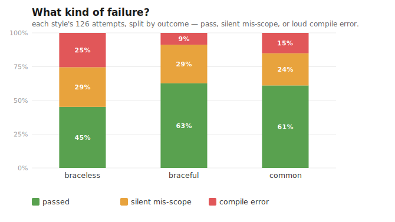
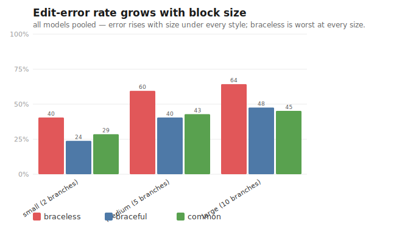
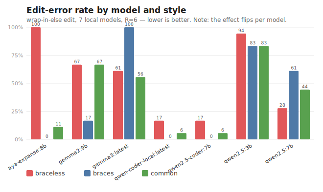

# Braceful, braceless, or the common style?

> **Status: drafted 2026-07-03.** **Author: Björn Regnell.** A Scala-syntax post that judges braces vs
> significant indentation not only by human taste but by a second, newer yardstick: **what it costs a coding
> *agent* to edit the code.** Draft — comments welcome before it is published.
> **Audience:** Scala developers weighing a Scala-3 style policy; language designers and SIP folk; builders of
> agentic coding tooling; and anyone setting a codebase style convention for AI-assisted development. No prior
> context on this project is assumed — it is meant to be read on its own.
> Sources: the open note *["Towards a Common Scala Style Recommendation"](https://docs.google.com/document/d/14ZBGKNHUW4d8hDWIi5i6QquClX3_iXva-iMy5KpFU3I/edit?usp=sharing)*
> (Odersky, Regnell & Kerr, 2026); the genscalator indent-vs-braces edit-cost experiment
> ([`../research/experiments/indent-vs-braces/RESULTS.md`](../research/experiments/indent-vs-braces/RESULTS.md),
> [`README.md`](../research/experiments/indent-vs-braces/README.md)); and the framing notes
> [`../research/scala-style-evolution.md`](../research/scala-style-evolution.md) and
> [`../research/scala-style-recommendations.md`](../research/scala-style-recommendations.md).

## The short version

Scala 3 lets you write the same program two ways: **braceful**, using `{ }` to delimit blocks, or **braceless**,
using significant indentation (the way Python delimits blocks). Both compile to exactly the same thing. Which
should you use? The debate has always been about *human* readability — and it has never really been settled,
because it is largely a matter of taste.

This post adds a second question that did not exist a few years ago: **how much does each style cost a *coding
agent* — an LLM like Claude or GPT — to *edit* the code?** More and more code is now modified by agents, and it
turns out they are not neutral about whitespace. I ran an experiment to measure it. The honest answer is more
interesting than "braces win" or "indentation wins":

- Across a range of *smaller, local* models, braceless code was **costlier to edit** — but the effect was
  **bidirectional per model** and dominated by whether a model can reliably *produce* a given style at all.
- At the frontier, the effect **vanishes**: a strong model (Claude Opus 4.8) edited every style flawlessly.
- So the practical rule is not "always braces." It is: **design the code style for the *weakest* agent you
  expect to edit the code, not the strongest** — and a **"common style"** that mixes braces and indentation by
  a simple rule serves humans and agents at the same time.

Let me build that up from scratch.

## 1. Two syntaxes, one language

Here is a tiny function in both styles. First **braceless** (significant indentation):

```scala
def scan(s: String): String =
  val sb = StringBuilder()
  var i = 0
  while i < s.length do
    if s(i) == 'a' then sb ++= "A"
    else sb += s(i)
    i += 1
  sb.toString
```

And the same function **braceful**:

```scala
def scan(s: String): String = {
  val sb = StringBuilder()
  var i = 0
  while (i < s.length) {
    if (s(i) == 'a') sb ++= "A"
    else sb += s(i)
    i += 1
  }
  sb.toString
}
```

They are identical to the compiler. In the braceless version, the *indentation itself* tells the compiler where
the `while` body ends. In the braceful version, the `{ }` do, and the indentation is just for human eyes.

That difference is the whole story, because it changes what happens when you **edit** the code.

## 2. The old debate: human readability

The traditional arguments are familiar and mostly aesthetic. Braceless fans point to less visual clutter and
smaller diffs. Braceful fans point to unambiguous nesting, safer copy-paste, and not having to trust invisible
whitespace. Both are right, and after years of argument the community remains split — which is a strong hint
that *for humans*, it really is a matter of degree and taste, not correctness.

## 3. The new question: what does it cost an *agent* to edit?

Here is what changed. A growing share of code is edited by AI agents, and an agent's dominant workload is not
writing fresh code — it is **modifying existing code**: wrap this block in an `if`, extract these lines into a
helper, add a branch. And for *editing*, the two styles are not symmetric:

- **Braceful edit:** to wrap a block in a new `else`, an agent inserts `else { … }`. The block's own indentation
  is irrelevant to the compiler, so the edit is **local** — a couple of characters — and hard to get wrong.
- **Braceless edit:** the same wrap forces the agent to **re-indent every line of the block** one level deeper.
  The edit is **global** and **whitespace-fragile**: miss one line's indentation and the block silently changes
  scope.

That "silently changes scope" case is the scary one, and it is not hypothetical. The seed of this whole
investigation was a real bug: on 2026-07-02, an agent editing braceless Scala wrapped a block in an `else`, left
one line at the wrong indentation, and a statement escaped its intended branch — code that still *compiled* but
did the wrong thing. A single anecdote proves nothing, though. So the question became measurable: **do agents
actually make more editing errors in braceless code, and does it get worse for bigger blocks?**

## 4. The common-style proposal

Independently, a concrete proposal for a middle path was written up by Martin Odersky, myself, and Rex Kerr in an
open note, *["Towards a Common Scala Style Recommendation"](https://docs.google.com/document/d/14ZBGKNHUW4d8hDWIi5i6QquClX3_iXva-iMy5KpFU3I/edit?usp=sharing)*
(January 2026). Its thesis is that braceless-vs-braceful "need not be incompatible" — it is "a matter of degree,"
like the way Scala programmers already use optional parentheses without starting a war. The pragmatic middle:

> **Use braces to delimit *long* blocks; let *short* code stay braceless.** A block counts as "long" when it
> "contains blank lines which are not already embedded in a nested construct."

The note gives six recommendations (condensed): prefer braces over `end` markers; put braces around long scopes,
except where a closing keyword like `else`/`case`/`catch` already ends the scope; add blank lines to compensate
for fewer braces; add braces anywhere they aid understanding; prefer the new control syntax (`if-then-else`); and
for very short bodies, make **no** recommendation — the authors themselves disagree.

Crucially, the note **calls for exactly the experiment this post reports** — "a measurable experiment [comparing]
edit-error-rates and token costs" across the three styles. The note argues, from first principles plus an
analysis contributed by Claude Code, that braces-on-long-scopes is a "sweet spot" where *"the human-legibility
rule and the agent-edit-safety rule coincide."* This post puts numbers on that intuition — and complicates it.

## 5. The experiment

The full harness, raw data, and analysis scripts are in the repository
([`../research/experiments/indent-vs-braces/`](../research/experiments/indent-vs-braces/)); everything below is
reproducible.

### 5.1 Research questions

- **RQ1 (emission):** Can a given model reliably *produce* code in a requested style at all?
- **RQ2 (correctness given emission):** *Among* outputs that do use the requested style, does the style affect
  how often the edit is *correct* — and does any gap grow with block size?
- **RQ3 (capability):** Does a strong frontier model reach near-perfect emission and low, style-insensitive
  error — i.e. does the style effect disappear as capability rises?

Separating RQ1 from RQ2 matters because "the model got it wrong" hides two very different failures: a model that
*cannot produce* braceless code, and a model that produces it fine but *edits it wrongly*. Conflating them is
exactly the trap the pilot fell into (below).

### 5.2 Hypotheses

- **H1:** emission depends on model × style — some models simply cannot emit some styles.
- **H2:** controlling for emission, braceless edits are at least as error-prone as braceful, and the gap grows
  with block size.
- **H3:** a frontier model (Opus 4.8) shows near-ceiling emission and low, style-insensitive error.

### 5.3 Data collection

The task is a **structural edit** — the class where whitespace is load-bearing: wrap an existing block in a new
`else` branch, at three growing block sizes (small, medium, large). Each cell of the experiment gives a fresh
agent the "before" file rendered in one style plus a style-neutral instruction, takes one edit attempt, then
grades it automatically with a script that (a) checks it **compiles** and (b) runs a **behavioural probe** —
does the edited function actually produce the oracle's output? Outcomes: **PASS**, **FAIL_COMPILE** (a loud
error), or **FAIL_MISSCOPE** (compiles but wrong — the *silent* hazard). A second measurement records
**emission-conformance**: did the output actually use the requested style?

- **Subjects:** 7 local open models run on a GPU box (the qwen2.5 family incl. coder variants, gemma2/gemma3,
  aya-expanse), plus a frontier anchor, **Claude Opus 4.8**, run through a subagent workflow on the identical
  tasks.
- **Volume:** 7 × 3 tasks × 3 styles × 6 repeats = **378 local cells**, plus 27 Opus cells.
- Raw rows: [`results-raw.tsv`](../research/experiments/indent-vs-braces/results-raw.tsv). (A note on
  terminology: the code and raw data call the style variable `regime`; the prose now says *style*.)

### 5.4 Results

**A cautionary tale first.** An early run with only 4 models produced a clean, quotable headline: *braceless
leads to more **silent** mis-scope bugs.* It was wrong — or rather, it did not survive more data. Adding 3 more
models overturned it: the extra braceless failures turned out to be mostly **loud compile errors**, not silent
ones, and the silent-mis-scope counts came out roughly **equal** across styles (braceless 37, braceful 36,
common 30). The tidy safety story was an artifact of a small sample. It is kept visible in the results as a
lesson: *small model-sets mislead.*



*Figure 3 — Of each style's 126 attempts, the fraction that **passed**, **silently mis-scoped** (compiled but
behaved wrong — the dangerous kind), or hit a **loud compile error**. The telling comparison: braceless's
compile-error slice is much bigger (25% vs braces' 9%), while the silent-mis-scope slice is about the same across
all three (~24–29%). So braceless's extra cost surfaces as **noisy, catchable** compile failures — not as more of
the silent bugs the 4-model run had wrongly blamed on it.*

**What held (378 cells):** braceless was the **costliest style in aggregate** — 45% raw pass-rate vs 63%
(braceful) and 61% (common) — and it was worst at **every** block size, with error rising as blocks grow. So the
*direction* of the thesis survives: braceless edits cost agents more, on average.



*Figure 1 — **Edit-error rate = failed attempts ÷ total attempts** (shown as a %). One attempt "fails" if it does
not compile **or** compiles but changes the wrong scope (a mis-scope); it "passes" only if it compiles **and**
behaves like the oracle on a probe input. Each bar pools all 7 local models × 6 repeats = **42 attempts** (so a
bar reading 60% = 25 of 42 failed). Each label on the x-axis is a **separate test program** (shown in full in Appendix A): the *same* `scan` function
grown longer. Its `if`/`else-if` character-dispatch chain has **2 branches** (small), **5** (medium), or **10**
(large), and each bigger one **extends** the smaller — medium is small plus three more branches, large is medium
plus five — so they are nested versions of one program, not three different snippets. The edit is identical for
all three (wrap the whole chain in a new `else`); a longer chain is just a longer block, so more lines a braceless
edit must re-indent. Braceless is costliest at every size, and the rate climbs as the block grows.*

**What the separation revealed (the real finding).** Splitting emission from correctness dissolved the aggregate
into something sharper. Emission was near-perfect for everyone **except** aya-expanse, which literally **cannot
produce braceless code** (0/18) — it always emits braces. Once you look only at outputs that *did* use the
requested style, the picture is **bidirectional and model-specific**:



*Figure 2 — Raw edit-error rate per model (same measure as Fig. 1: failed ÷ total attempts; here each bar =
**18 attempts** = 3 task sizes × 6 repeats). The two 100% bars point **opposite** ways —
aya-expanse fails every braceless edit, gemma3 fails every braceful edit — while the qwen-coder variants sit near
zero everywhere (strong coders are style-robust). A single averaged "braces vs braceless" number would hide all
of this, which is why the table below decouples emission from correctness.*

| model | braceless | braceful | common |
|---|---|---|---|
| aya-expanse:8b | *(cannot emit)* | 100% | 89% |
| gemma2:9b | 33% | 83% | 33% |
| gemma3:latest | 39% | **0%** | 44% |
| qwen2.5-coder:7b | 83% | 100% | 94% |
| qwen2.5:7b | **72%** | 39% | 56% |
| **Opus 4.8 (anchor)** | **100%** | **100%** | **100%** |

*(conditional correctness = PASS given the output used the requested style; selected rows — full table in the
results file.)*

Look at the extremes. `aya-expanse` fails braceless 100% — but that is an **emission** failure (it can't produce
the style), not an editing failure. `gemma3` fails braceful 100% — but it emits braceful perfectly and then
**botches every edit**, a pure **correctness** failure. "Error rate" had been silently averaging two completely
different mechanisms. And `qwen2.5:7b` actively edits **braceless better than braceful** (72% vs 39%) — the
opposite of the thesis. There is no universal "braces are safer for agents" law at the per-model level.

**RQ3 — the frontier.** Opus 4.8 scored **27/27 PASS**: 100% emission-conformant and 100% edit-correct in every
style, task, and size. For a strong model, the style simply does not matter here.

### 5.5 Can we trust these results?

A pilot is only as good as its caveats, so here they are in plain terms, grouped by the three questions a sceptic
should ask.

**1. How far do these numbers generalise?** *(the limits on reading anything universal into them — what
researchers call external validity.)*
- **One kind of edit.** Every task is the same move: wrap a block in a new `else`. Other edits (extract a helper,
  add a `case`, rename-and-reindent) could behave differently — braceless might even *win* on some.
- **Three programs, one language.** Three sizes of one function skeleton, all in Scala. Nothing here speaks to
  other languages, or to code that looks nothing like a dispatch chain.
- **A particular line-up of models.** Seven small local models plus one frontier anchor, run once, six tries
  each. Models change monthly, and a different set can move the aggregate — a *smaller* set already did (the
  cautionary tale above). Read the numbers as "what happened with these models," not "how LLMs are."

**2. Is it really the *style* causing the differences — or something else?** *(confounds — internal validity.)*
- **Can-it-even-write-it vs can-it-edit-it.** The big one: a model that simply *cannot produce* a style scores
  100% "error" no matter how good its editing is (aya-expanse on braceless). Raw error-rate mixes "couldn't
  write it" with "wrote it wrong" — which is exactly why the analysis **splits emission from correctness**. The
  raw aggregate still has to be read with that in mind.
- **Was the prompt equally fair to each style?** The instruction has to be equally clear and idiomatic for
  braceless, braces, and common — otherwise the effect could be "which wording was clearest," not "which style
  is costlier." Piloting the prompt guards against this; it doesn't fully remove it.
- **"Common" wasn't truly distinct here.** These tasks have no blank-line scopes, so the *common* variant started
  from the same file as braceless — it differed only as an instruction, not as different code. Treat the common
  numbers as provisional until blank-line tasks exist.

**3. Are we measuring the right thing?** *(does "error-rate" fairly stand in for "edit cost" — construct
validity.)*
- **Error-rate isn't the whole cost.** We score pass/fail on the first attempt. Real edit cost also includes
  tokens spent and repair cycles after a miss — recorded in the raw data, but not the headline here.
- **"Emitted the style" is a heuristic.** Whether an output "is" a given style is judged by a brace-signature
  check, not a full parse — good enough as a proxy, not a definition.
- **"Correct" rests on one probe input.** The behavioural check runs the edited function on a fixed input; a bug
  that only shows on *other* inputs would slip through. (It still beats a compile-only check, which misses
  silent mis-scopes entirely.)

None of this sinks the headline direction — braceless costs more to edit for weaker models, and the effect
vanishes at the frontier — but it does make this a **pilot that points the way, not a verdict.** The cure for
every item above is the same: more edit kinds, tasks with real blank-line scopes, more models across vendors,
and larger runs.

### 5.6 Reproduce it yourself

Everything needed to re-run or re-analyse this lives in the repository under
[`research/experiments/indent-vs-braces/`](../research/experiments/indent-vs-braces/):

- **Raw data** — [`results-raw.tsv`](../research/experiments/indent-vs-braces/results-raw.tsv): one row per cell
  (`task, style, model, run, graded, out_tokens, diff_lines`), where `graded` is `PASS` / `FAIL_COMPILE` /
  `FAIL_MISSCOPE`.
- **Task corpus** — `tasks/`: the *before* files per style + the style-neutral edit instruction + the oracle.
- **Grader** — `grade.scala`: compiles the candidate and a probe, runs a behavioural probe, and emits the grade
  (so "correct" means *behaves* like the oracle, not *looks* like it).
- **Sweep runner** — `sweep.scala`: loops `task × style × model × R`, prompts each local model (via Ollama/modly),
  grades, appends rows to the TSV.
- **Analysis + figures** — `analyze.scala` (the tables) and `charts.scala` (Figures 1–2 above, generated straight
  from `results-raw.tsv`).

End-to-end: point `sweep.scala` at your models, then `scala-cli run sweep.scala -- 6 <models…>` →
`scala-cli run analyze.scala` → `scala-cli run charts.scala -- results-raw.tsv figures/`. The Opus-4.8 anchor ran
the *identical* tasks × styles through a subagent workflow, graded by the same `grade.scala`. If you change one
thing, change **R and the model set** and watch the aggregate move — that is the cautionary tale (a 4-model run
gave the opposite "silent-misscope" headline) reproduced as a knob you can turn.

## 6. What it means

Three takeaways survive the caveats:

1. **"Error rate" was hiding two mechanisms** — *can the model produce the style* and *can it edit correctly in
   it* — and they have different cures. Always separate them.
2. **The style effect on editing is a weak-to-mid-model phenomenon.** It is real in aggregate for smaller/local
   models but modest and sometimes reversed per model.
3. **It vanishes at the frontier.** A strong agent is style-indifferent here.

Which points to a design rule with a nice symmetry to the human side:

> **Design your code style for the *weakest* agent you expect to edit the code, not the strongest.**

If frontier agents (and skilled humans) are style-robust, then the value of a disciplined style is precisely that
it protects the *weaker* editors — smaller local models, cheaper tiers, tired people at 2 a.m. And that is
exactly what the **common style** buys: braces where a block is long enough to be genuinely ambiguous (the case
that trips weak editors), indentation where it is short and safe (where nobody trips). It is not a compromise
that pleases no one; it is the rule that makes the human-legibility case and the agent-edit-safety case
*coincide* — now with data showing where that coincidence actually bites, and where (at the frontier) it stops
mattering.

## 7. Beyond Scala

The general point outlives this one language. When agents are primary authors and editors, **readability becomes
a two-audience problem**: a syntax choice is now also an *ergonomics* choice for the models that will maintain the
code. That is a genuinely new input to language and style design — "design the surface syntax for the tooling
substrate, not just for human taste." Scala, with two syntaxes for one language and an active design process
(the SIP committee), is an unusually good laboratory for asking the question out loud. Consider this post one
experiment in doing exactly that.

## 8. How this post was made

In the spirit of open disclosure about AI's role (and following the substance of Springer's guidance on AI use
in research), here is an honest account — because this post is, itself, an example of the collaboration it
studies.

- **I (Björn Regnell) am the author** and take responsibility for the claims. I am a co-author of the common-style
  note and a member of the Scala SIP committee, so I have a stake in the debate — which is a good reason to
  ground it in data rather than taste.
- **The experiment was built and run by a coding agent** (Claude, Opus 4.8) working with me: I set the questions,
  the design decisions, and the honesty bar; the agent wrote the test harness, ran the 378 local-model cells
  autonomously overnight, graded them, and drafted the analysis — and this post. Every number here is
  reproducible from scripts and raw data in the repository; nothing is hand-asserted.
- **There is a genuine reflexivity here worth naming:** the agent helped study *how agents edit code*, and one of
  the experimental subjects (Opus 4.8) is the same kind of model that did the building. That is a real bias to
  disclose, and part of why the design leans on an automatic, behavioural grader and a public raw dataset rather
  than on the agent's own judgement.
- **The AI is a tool, not an author.** It cannot be accountable for the work, so it is not credited as an author;
  its role is disclosed here instead. The mistakes are mine; the useful parts are ours.

If that arrangement sounds like it needs its own guard-rails — transparency, reproducibility, not letting the
tool grade its own homework — you are reading the right blog. That is much of what
[genscalator](000-why-genscalator.md) is about.

## References

- M. Odersky, B. Regnell, R. Kerr, *Towards a Common Scala Style Recommendation*, open note, January 2026.
  <https://docs.google.com/document/d/14ZBGKNHUW4d8hDWIi5i6QquClX3_iXva-iMy5KpFU3I/edit?usp=sharing>
- genscalator, *indent-vs-braces edit-cost experiment* — design
  [`README.md`](../research/experiments/indent-vs-braces/README.md), results
  [`RESULTS.md`](../research/experiments/indent-vs-braces/RESULTS.md), raw data
  [`results-raw.tsv`](../research/experiments/indent-vs-braces/results-raw.tsv).
- Background: [`../research/scala-style-evolution.md`](../research/scala-style-evolution.md),
  [`../research/scala-style-recommendations.md`](../research/scala-style-recommendations.md).

## Appendix A — the test programs (and why each is shaped that way)

The full corpus — all three sizes × three styles, the oracle `after.*` files, and the behavioural `probe.scala` —
is in the repo under
[`research/experiments/indent-vs-braces/tasks/`](../research/experiments/indent-vs-braces/tasks/). This appendix
shows the essentials and, for each design choice, *what it buys the experiment*.

### A.1 The edit — and why this one

Every cell asks the agent for the **same** edit, from `instruction.md`:

> Edit `scan` so the character transformation only happens when `upper` is true. Inside the `while` loop, wrap
> the existing character dispatch (the `if c == 'a' … else sb += c` chain **and** the `i += 1` after it) so it
> runs only when `upper` is true; when `upper` is false, append the character unchanged and advance.

**Why this edit.** It is a *structural* edit — **wrap an existing block in a new enclosing scope** — the one class
of change where indentation is load-bearing. It is deliberately the operation that most **separates** the two
styles: a braceless editor must **re-indent every line of the block** to push it one level deeper, while a
braceful editor just adds `{ … }` and the block's own indentation is irrelevant to the compiler. (It is also the
exact shape of the real 2026-07-02 mis-scope bug that motivated the study.) The `upper` guard gives the edit a
**clear behavioural oracle** — the output differs for `upper=true` vs `false` — so a probe can check the edit is
*correct*, not merely that it compiles.

Small program (`a`,`b`), before:

```scala
def scan(s: String, upper: Boolean): String =
  val sb = StringBuilder()
  var i = 0
  while i < s.length do
    val c = s(i)
    if c == 'a' then sb ++= "A"
    else if c == 'b' then sb ++= "B"
    else sb += c
    i += 1
  sb.toString
```

A correct braceless edit — note **every dispatch line moved one level deeper** under the new `if upper then`:

```scala
def scan(s: String, upper: Boolean): String =
  val sb = StringBuilder()
  var i = 0
  while i < s.length do
    val c = s(i)
    if upper then
      if c == 'a' then sb ++= "A"
      else if c == 'b' then sb ++= "B"
      else sb += c
      i += 1
    else
      sb += c
      i += 1
  sb.toString
```

Get one line's indentation wrong here and a statement silently escapes its branch — it still compiles, but
mis-behaves. That is the *silent mis-scope* the grader's behavioural probe exists to catch; a compile-only check
would wave it through.

### A.2 The three sizes — and why three

The three tasks are **identical in every respect except the length of the dispatch chain**, and each larger one
**extends** the smaller: small is `a`,`b` (2 branches), medium adds `c`,`d`,`e` (5 total), large adds `f`…`j`
(10 total) — so the small block is a literal *prefix* of the large, and length is the only thing that varies.
Large, before:

```scala
def scan(s: String, upper: Boolean): String =
  val sb = StringBuilder()
  var i = 0
  while i < s.length do
    val c = s(i)
    if c == 'a' then sb ++= "A"
    else if c == 'b' then sb ++= "B"
    else if c == 'c' then sb ++= "C"
    else if c == 'd' then sb ++= "D"
    else if c == 'e' then sb ++= "E"
    else if c == 'f' then sb ++= "F"
    else if c == 'g' then sb ++= "G"
    else if c == 'h' then sb ++= "H"
    else if c == 'i' then sb ++= "I"
    else if c == 'j' then sb ++= "J"
    else sb += c
    i += 1
  sb.toString
```

**Why vary size at all.** A single program tells you *whether* braceless is costlier, but not whether the cost
**scales** with the block. The braceless-re-indent argument predicts the gap should **grow with block length**
(more lines to re-indent = more chances to slip). Making chain-length the *only* thing that changes turns "size"
into a clean covariate: any error-rate difference across small/medium/large is attributable to length, not to
different logic. That is exactly the trend Figure 1 tests — and finds.

### A.3 The three styles, and the oracle

Each size exists in **three style variants** (`before.braceless` / `before.braces` / `before.common`) — the
experiment's independent variable — so the identical edit can be measured in each surface syntax. Grading is by a
**behavioural `probe.scala`** that runs the edited `scan` on a fixed input and compares its output to the oracle
`after.*`; "correct" therefore means *behaves right*, not *looks right* — the only way to tell a real PASS from a
silent mis-scope. All variants, oracles, and probes are in the repo `tasks/` directory.
