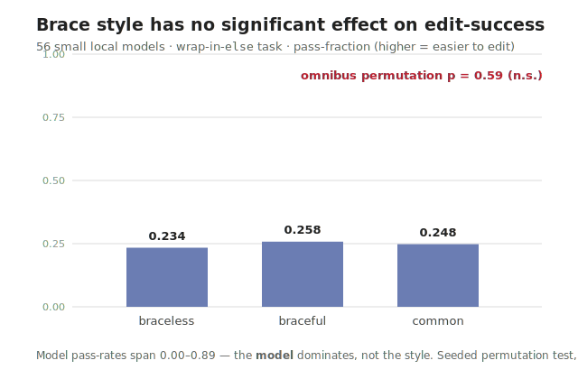

# A bigger common-style experiment (003) — STUB / preregistered, not yet run

> **Status: run complete 2026-07-04 — a preregistered NULL. Author: Björn Regnell.** The confirmatory sequel to
> [002](002-braceful-or-braceless-or-the-common-style.md). The **Results** + **What it means** sections below are
> **agent-drafted from the data for BR to rewrite in his voice**; every number is reproducible from the committed
> script, frozen seed, and raw data. The run reported *whatever it found* — and it found a clean null.

## Why a sequel

[002](002-braceful-or-braceless-or-the-common-style.md) was an honest **pilot with a null**: across 7 small local
models, braceless edits were costlier *in aggregate* (−17.5 pp pass-rate vs braceful) but the effect was **not
statistically significant** (exact permutation p ≈ 0.46) and **bidirectional per model**. A pilot points the way; it
does not settle the question. 002 §7 named exactly what a verdict needs — *more models, for statistical power.* This
post is that follow-up: a larger run **designed in advance** to have a real chance of confirming or refuting the
direction, **without fishing for the result.**

**Pilot proposes, preregistered run disposes.** 002 *generated* the hypothesis; 003 *tests it out-of-sample* on
models disjoint from the pilot's 7.

## The preregistration (the honesty guarantee)

The full frozen design lives at
[`../research/experiments/indent-vs-braces/BIG-RUN-PREREG.md`](../research/experiments/indent-vs-braces/BIG-RUN-PREREG.md).
Its anti-fishing core: **fixed n, one primary test, no optional stopping, a committed random seed, and a standing
commitment to report the null if it stands.** (Preregistration = lock the hypotheses, sample size, primary test and
analysis script *before* collecting data — so you can't try many tests and report the smallest p, drop inconvenient
models, or stop the moment it looks good.)

- **Primary test:** paired permutation, braceless vs braceful pass-rate, **blocked by model** (the model is the unit
  of replication — pooling cells is the pseudoreplication that faked p = 0.008 in 002 §5.5).
- **Power basis:** the pilot's effect size is small (d ≈ 0.37, inflated by outliers) → ~55 models for 80% power.
- **The frozen sample (committed before any data):** **56 candidate models**, all ≤ ~8B (quantised, to fit the
  6 GB card), **disjoint from the pilot 7**, picked for family/vendor diversity — Qwen, Gemma, Llama, Phi, Mistral,
  DeepSeek, StarCoder2, Granite, plus a long tail of community fine-tunes. The exact tag list and the seed are frozen
  in `BIG-RUN-PREREG.md` §3-FROZEN and in `models-frozen.txt`. **No-drop rule:** every model that pulls *and* runs is
  in the analysis; a model that cannot be pulled or will not load is logged as such (itself an adherence datum), never
  quietly swapped for a friendlier one. 56 candidates brackets the ~55 the power calc wants — the run sits honestly at
  the *edge* of being able to reach significance, which is the informative place to be.
- **Disjointness is verified by model *ID*, not tag string (an integrity detail found mid-run).** "Disjoint from the
  pilot 7" has to be checked on the actual weights, because an ollama *tag* can alias a model already present — e.g.
  `gemma3:4b` pulled in 0 s, the tell-tale of shared layers with the pilot's `gemma3:latest` (gemma3's default *is*
  the 4B). So at analysis the confirmatory set is deduplicated by each model's **ollama content-ID**, and any tag
  whose ID equals a pilot model's is folded out; the post reports the **effective disjoint n** (which may sit a
  model or two below 56) and names any tags that collapsed. Logged as it happened in
  [`../research/experiments/indent-vs-braces/RUN-LOG.md`](../research/experiments/indent-vs-braces/RUN-LOG.md) — the
  frozen list stays exactly as committed; only the *reported* effective n reflects the dedup.

## Hardware & feasibility — why the "lame GPU" is actually on-target

Checked 2026-07-03, `bjornyx.local`: Quadro RTX 3000 **6 GB VRAM**, **523 GB free disk**, 30 GB RAM, 16 cores.
**No showstopper:** VRAM caps model *size* (≤ ~8B, quantised), not *count*; the disk holds 100+ small models; the
frozen 56 models × 3 024 cells (3 task sizes × 3 styles × R = 6) is a single overnight autonomous job (the pilot
already ran 378 cells autonomously).

The reframe that matters: 002's rule is *"design for the weakest agent that will edit the code."* So **small local
models ARE the target population** for the weak-editor question — a 6 GB card testing many of them is the right
instrument, not a poor-man's substitute. What it *can't* reach is mid/large models — a separate question (the
capability gradient), which is what bigger hardware would add.

## Tiered design

- **Tier A — small-model confirmatory (bjornyx, runnable now).** ~50 distinct ≤8B models disjoint from the pilot 7,
  the 002 task family (wrap-in-`else`, 3 sizes, 3 styles), R = 6. Answers: *does braceless-costs-more hold, and
  significantly, across many weak models?* One overnight AFK job.
- **Tier B — capability gradient (bigger hardware, later / optional).** Add mid-tier models (needs more VRAM — a work
  GPU) to trace how the effect shrinks from small → frontier, **bridging 002's two endpoints** (weak-model effect vs
  the frontier's zero effect). A bonus, not a prerequisite for Tier A.

## Research questions & hypotheses

Frozen in the prereg (H1 adherence · H2 primary: braceless ≥ braceful error, controlling for adherence · H3
frontier: style-insensitive at the top). See `BIG-RUN-PREREG.md` §1–2.

## How significance will be judged (and why the p-value can be trusted)

The primary test is the same one 002 used — a **paired permutation test, blocked by model** — but the honest sample
size forces one change to the machinery. At ~50 models the *exact* enumeration 002 relied on (walk all 6ⁿ ways of
relabelling the styles within each model) is impossible: 6⁵⁰ is an astronomically large number. So the frozen
analysis switches to a **seeded Monte-Carlo permutation** — draw 100 000 random relabellings from the very same null
distribution, with a **committed random seed** (`20260703`) so the resulting p-value is reproducible to the digit by
anyone who re-runs the script.

Two safeguards travel with that switch:

- **The Monte-Carlo was validated against the exact truth on the pilot.** Run on the 7-model pilot (where exact
  enumeration is still feasible), the seeded Monte-Carlo reproduces the exact permutation p-values — omnibus **0.460
  vs the exact 0.457**, and all three pairwise tests within ±0.002. So the sampler is not adding bias; it is the
  identical test, merely *sampled* instead of *enumerated*. Only once that agreement held did we freeze it as the
  big-run analysis path.
- **The pseudoreplication foil stays on screen.** The same script still prints the naive "pool every cell as
  independent" chi-square — the one that faked **p ≈ 0.008** in [002 §5.5](002-braceful-or-braceless-or-the-common-style.md)
  — right next to the correct model-blocked test, as a permanent reminder of the mistake we are refusing to make.

Plain-language glosses (as in 002, repeated here for readers who land directly on 003): a **permutation test** makes
no bell-curve assumption — it shuffles the style labels many times and asks how often chance alone yields an effect as
large as the one observed; that fraction *is* the p-value. **Blocked by model** means the shuffling happens only
*within* each model, never across them, because the model is the unit that genuinely repeats. **Monte-Carlo** is what
you do when there are too many shuffles to list them all — sample a large random subset instead — and the **seed** is
the fixed starting number that makes that random sample reproducible.

## An operational wrinkle: slow models, and what a non-answer (NORESP) means

Worth stating plainly, because it shapes both the wall-clock and the data: **the edit tasks are tiny.** Each is a
12–20 line program and a *single* small change — "wrap this character-dispatch in an `else` so it only runs when
`upper` is true." Not big programs, not many edits. So when a model is slow, it is **not** the task's fault.

What's slow is **model verbosity**. The **reasoning models** (the deepseek-r1 family) emit ~**675–773 output
tokens** for one of these one-line edits — that's a `<think>…</think>` chain-of-thought, reasoning out loud at length
before (maybe) producing the ~5-line answer. A fast non-reasoning model of similar size does the identical task in
~**76–163 tokens** — 5–10× less generation. On a 6 GB card, a reasoning model routinely spends its whole per-cell
time budget mid-thought and **runs out before answering** — recorded as **`NORESP`** (no response).

So a chunk of the cells, concentrated in a handful of models, are `NORESP`. Two things about that, both in the
honest-methods spirit of 002:

- **A `NORESP` is a legitimate outcome, not missing data.** It says "this model did not deliver a usable edit within
  the budget" — which, for the *weak-editor* question this experiment asks, is exactly the kind of signal we want:
  some models are unsuitable as editors not because their code is wrong but because they are **too verbose or slow to
  be practical** at all. It is graded as a fail and **kept** (the no-drop rule), never quietly dropped.
- **It's why the run is slow, and that's fine.** The reasoning trio dominated the wall-clock (a few models eating
  hours of timeouts) — an operational cost, not a threat to the result. The analysis is **blocked by model**, so a
  slow all-fail model contributes its one model-level data point and no more; it cannot swamp the others.

(Operational detail during the run, for full disclosure: the ~10 h job was **externally interrupted once** at 31% by
the compute host and **resumed from a per-cell checkpoint** with zero lost or duplicated cells — see the experiment
`RUN-LOG.md`. The frozen design was untouched.)

## Results (run 2026-07-04, n = 56)

**A clean, preregistered NULL: brace style does not significantly affect edit-success.**

*Figure 1 — the whole result in one picture. The three styles' pass-fractions across 56 models are near-identical
(braceless 0.234, braceful 0.258, common 0.248); the omnibus within-model permutation test finds p = 0.59.*

- **Primary test — omnibus within-model permutation** (seed `20260703`, R = 100 000, blocked by model): **p = 0.59.**
  Not significant.
- **Pairwise** (paired sign-flip, two-sided): braceless−braceful −0.024 (p = 0.40); braceless−common −0.014
  (p = 0.43); braceful−common +0.010 (p = 0.73). **Friedman** χ² = 4.18, p = 0.12. The pseudoreplication foil — the
  naive pooled test that faked p ≈ 0.008 in 002 §5.5 — is *also* null here (p ≈ 0.46).
- **The tiny aggregate signals even disagree in direction:** column-means faintly favour *braceful*, within-model
  ranks faintly favour *braceless* — the signature of a **bidirectional, per-model** effect that cancels.
- **The model dominates, not the style:** pass-rates span 0.00 → 0.89, with ~10 models flat-zero across all styles.
- **Effective n:** 56 distinct tags; by content-ID only `gemma3:4b` aliases a pilot model (`gemma3:latest`), so 55/56
  are out-of-sample vs the pilot — no drop, reported. Full numbers + per-model table:
  [`../research/experiments/indent-vs-braces/RESULTS.md`](../research/experiments/indent-vs-braces/RESULTS.md).

## What it means

> **[Agent-drafted from the data — for BR to rewrite in his voice.]**

The pilot's aggregate "braceless costliest" **does not replicate at n = 56.** The direction survives in the
column-means as a whisper (braceful highest by 2.4 pp) but the effect size **collapsed ~7×** from the pilot's −17.5 pp
and is nowhere near significant — consistent with the pilot estimate being outlier-inflated. Because the design sat
honestly at the *edge of power* (56 ≈ the ~55 needed for 80% at the pilot's d), a null here is informative, not merely
inconclusive: a population-level style effect *of the pilot's size* had ~80% chance to appear and did not.

The honest read: **for the weak-editor question, brace style is not a meaningful lever — model capability is.** What
predicts whether a small model can wrap a block in an `else` is *which model it is* (0.00 → 0.89), not which syntax it
is shown. This refines rather than contradicts 002: 002 already found the effect *bidirectional and emission-dominated*;
003 confirms at scale that once you block by model and stop pseudoreplicating, the residual style signal is noise. The
common-style / SIP argument, then, gets no support *here* from a universal small-model edit-cost — its case must rest on
the frontier-and-human ergonomics 002 pointed to, not on a measurable weak-model penalty.

*(A preregistered confirmatory run that reports its null cleanly is worth more than a p-hacked positive.)*

## How this post was made

Same disclosure ethos as [002 §9](002-braceful-or-braceless-or-the-common-style.md): Björn Regnell is the author and
accountable; a coding agent built and ran the harness; every number will be reproducible from the committed scripts,
raw data, and the preregistration; the AI is a disclosed tool, not an author.

---

*Working notes / plans accumulate here and in `BIG-RUN-PREREG.md` until the run is scheduled.*
