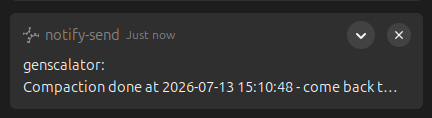

# 004 — Why Claude's UX sometimes sucks (and how we'd fix it)

**Status: STUB.** TODO: mine WR data for UX problems.

> **The 004→008 arc.** Read in order **004 → 005 → 006 → 007**, then **008** (synthesis). Together they descend a
> stack — **Pains** (004) → **Practice** (005) → **Method** (006) → **Theory** (007): the Theory-Method-Practice-Pains
> chain, read bottom-up. *Backwards cliffhanger:* the thing you just felt has a deeper cause one post down.
> **You are here: the Pains.** → Next (005): the *practice* we grew to cope with them — the "dances".

**[figure — TODO, real data]** The FleetView-warp episode drawn from the `jsonl` transcripts: a **warp-timeline**
(keystroke → UI warp → agent silence → the panic writes on a clock → Ctrl+D+D → resume-fork reunion) and/or the
**session-fork lineage graph** (original session → orphan spawns → the resume-fork this work continued in). This is the
Act-V evidence *as* the figure — the same externalized substrate that recovered the panic writes, rendered. Source:
[`fleetview-warp-panic-writes-2026-07-04.md`](../research/wr-data/fleetview-warp-panic-writes-2026-07-04.md) + the
transcripts.

**TODO: include the HUMAN's personal experience on the pain side.** These pains are *joint*, not just agent-observed
papercuts — write BR's own felt frustration in the first person: the mis-click that lands "yes" on the wrong prompt;
losing a carefully-typed message to the double-post race; the irritation of not being able to read `/context` while
the agent is mid-turn; watching the agent reach for raw bash for the Nth time. The human's lived friction is half the
data, and the more relatable half.

<!-- AGENT-DRAFT 2026-07-12 (BR to revoice / approve / place): a first attempt at the "mis-click" pain beat above,
written in BR's voice, escalating UX-into-safety. Source: research/wr-data/accidental-tab-fires-suggested-trigger-word-2026-07-12.md -->

### The tasty tab key (a small slip with a big shadow)

Here is a tiny one that made me laugh, and then made me a little uneasy.

I was typing to the agent, and the tool offered me one of those greyed-out autocomplete suggestions. It had slipped a
*trigger* word into the suggestion, the kind of word that, if you send it, flips the whole session into a different
mode. I did not want that word. But the tab key is *right there*, so tasty and so easy to press, and my finger pressed
it before my brain caught up. Off it went. I had fired a word I never chose, suggested by the machine, accepted by a
reflex.

No harm done. I laughed about it. The agent, being an agent, cannot laugh, but it caught the joke and handed it back,
which is its own funny thing. And we were only talking about a mode switch.

Then the uneasy part. It is not a big deal for us. It would be a very big deal for humankind if, hypothetically, that
same tasty tab had let the bombers go and nuked some folks. The slip is the same slip. Only the stakes change.

That is the whole point, and it is why UX is not just about comfort. It is about *safety*. A consequential action
sitting behind a single, frictionless keystroke is a disaster waiting for the wrong context. The fix is boring, and it
is the same one a good agent already applies to itself: **the friction should match the stakes**. Anything you cannot
easily undo should cost more than one tap, and it should cost even more when the thing you are tapping was put in front
of you by a machine.

**The high-level frame (BR — why these bugs hit disproportionately hard).** A human embarks on a big endeavour and
pours in energy, feelings, hours, sleepless nights — to do things with AI that were *never possible before*. The
stakes feel high and the work often feels irreproducible. So when a UX bug breaks the flow, it is not a minor
annoyance — it's a gut-punch out of all proportion to the bug's technical size. **A UX failure's severity scales with
the human's investment, not with the size of the bug.** A stray keystroke is trivial; a stray keystroke that *seems*
to swallow a sleepless-night's work is devastating. This is the thesis of 004: agent UX carries **emotional** stakes,
because the people pushing hardest on it are all-in on something new — and the tooling must be built knowing that.

**Verbatim source — the "panic writes"** (a real gut-punch caught live, 2026-07-04): see
[`fleetview-warp-panic-writes-2026-07-04.md`](../research/wr-data/fleetview-warp-panic-writes-2026-07-04.md) — an
accidental keystroke warped BR into FleetView, his messages spawned orphan sessions, the agent went silent, and he
typed "UX CHANGED under my feet", "I get no answers from you", "anything lost?", "aaargh I want back the other session
feed". Quote these; they *are* the emotional core of this post.

**Narrative direction (BR): write 004 as a THRILLER.** The reader should *feel* the panic first, then the flip into
thriller-mode when the UX hiccup turns into a big finding. Don't report the episode — *stage* it. The FleetView warp
is the spine:
- **Act I — normalcy under load.** A long, high-stakes AFK research run; the human all-in, hours deep, tired. Stakes
  established (the emotional-stakes frame above is the *why* the coming panic is earned).
- **Act II — the inciting hiccup.** One stray keystroke; the UI warps; the ground shifts — *"UX CHANGED under my feet."*
- **Act III — rising panic (first person, present tense).** Messages vanish into the void; the agent goes silent; dread
  compounds beat by beat — *"I get no answers from you" … "anything lost?" … "aaargh I want back the other session
  feed."* A ticking clock and no reply. Let the reader sweat.
- **Act IV — the desperate act + reunion.** Ctrl+D+D, the resume-fork confusion, then the relief of landing back in the
  intact session.
- **Act V — the twist: the disaster IS the discovery.** *"Can you access it?"* → the agent turns detective, introspects
  its **own** substrate (the `jsonl` transcripts), and recovers the panic writes verbatim — even its own fork lineage.
  The crisis becomes the evidence.
- **Payoff.** The very files that let the agent recover the human's panic are the same externalized substrate the whole
  theory (007) rests on — and the self-recovery is the self-model/agency finding (006). The UX pain didn't just hurt; it
  **demonstrated the thesis.** Release the reader from fear into revelation.

Craft notes: first-person + present tense for the panic acts; verbatim panic-writes as the beats; withhold the reveal
until the reader has felt the loss; make them *feel it before they understand it*.

Source material to mine (Workflow-Research "WR data", logged live during real agentic runs):
- `research/wr-data/harness-ux.md` — the primary log. Recurring themes already captured there:
  - **Input races** — arrow-up "edit a just-sent message" → double-post; Enter landing on a confirmation prompt;
    agent-fired modals stealing the human's typing focus; `$(…)` command-substitution tripping the confirmation guard
    then a mis-click on the prompt.
  - **Can't read the gauge when you need it** — `/context` blocked while messages are queued / the agent is mid-turn,
    exactly when a human on a long AFK run wants a fill/rot read without interrupting.
  - **Bash-reflex cluster** — the agent reaches for `ls`/`cat`/`grep`/`echo`-glued compounds instead of typed tools;
    each is a small UX-and-safety papercut (noise, confirmation prompts, lossy composition).
- `research/006-smart-zone-ceiling.md` — fill-vs-rot, monitor-tick cadence as a rot knob.
- Related memories: harness-double-post-edit-race, no-interrupting-modals-during-flow, propose-compact-dance-at-trigger.

**TODO stub — the plan-mode ("p-word") trap** *(2026-07-11 episode; a fresh, self-contained UX-pain specimen, maybe a
second staged mini-episode after the FleetView warp).* What happened, in line with the WR data: an ordinary word
("plan") in a chat message silently switched the harness into **plan-mode-the-workflow** (a keyword collision; the
human meant *draft a design doc*, not "enter the mode"). It **warped the human into a modal state** they never
requested (*"somewhere else without knowing what is going on"*), and its **approval was overloaded** (accept = execute
now), which flipped the agent into autonomous execution unexpectedly. Then **misleading chrome outlived it**: a stale
*"Next: Render Arc-2…"* status line (which survived a compact, a plan-mode cycle, and an overnight gap) plus a lingering
inverted-cyan `…-release-prep` marker that made the human think the mode was still on. Three UX faults: a disorienting
mode-warp, redundancy (we already plan freely in tmp docs and chat), and a language tax (having to avoid a common
word). The deeper theme is 004's spine: **trust the checkable substrate, not the chrome** (the agent dispelled the "is
my git flow diverted?" worry by reading git, not the marker). It fits the 004 family too: a timing/observability/control
race between a human action and the system's mode-classifier. Sources:
[`plan-mode-approval-flips-to-automode-surprise-2026-07-11.md`](../research/wr-data/plan-mode-approval-flips-to-automode-surprise-2026-07-11.md),
[`does-harness-disinformation-survive-a-compact-2026-07-10.md`](../research/wr-data/does-harness-disinformation-survive-a-compact-2026-07-10.md).
Harness-side asks: separate a plan's *acceptance* from its *execution-trigger*; do not mode-switch on ordinary words;
clear stale status chrome. Structural fix idea: de-trigger words in the super-harness input tap (SM016).

**The compaction pain (BR) + the ask.** `[for BR to voice in the first person]` Compaction is the highest-stakes
routine action in a long run — it *rewrites the shared memory* — and yet the UX around *when* to do it is reactive, not
proactive. This session the only signal I got was the harness firing **"Context is 90% full … Use `/compact` now"** —
which lands *late*, well past the smart zone, right when a tired human least wants a scramble. What I'd have wanted from
Anthropic is a **better compaction UX**: a **setting for a proactive reminder** that nudges me to compact while I'm
still in the smart zone — parameterised by a **ceiling `Z`** (the fill fraction I consider my smart working limit) so
the reminder fires at, say, **0.8·Z**, not at the harness's fixed 90%. The smart-zone threshold is *personal and
task-dependent* (a delicate research run wants a lower `Z` than a throwaway task), so it should be *my* knob, not a
hard-coded panic line. Pairs with the compact-dance practice (005), the smart-zone-ceiling note, and the
`propose-compact-dance-at-trigger` memory: the *human* wants a harness reminder at `0.8·Z`; the *agent* already proposes
the dance at that crossing — so today the
agent is doing the harness's job by hand. **The ask: make the smart-zone compaction reminder a first-class, `Z`-tunable
setting.**

<!-- AGENT-DRAFT 2026-07-13 (BR to revoice / approve / place): the second compaction pain, the wander-off one.
Sources: foundations "Compact sleep"; research/wr-data/agent-cannot-see-compaction-finish-2026-07-13.md;
tmp/compact-chrono-stamps.md (the hand-stamps that turned out to measure wake-latency). -->

**Compact sleep, the wander-off pain (BR).** `[for BR to voice in the first person]` There is a second compaction
pain, and it is quieter than the first. A compaction takes *long*, long enough that I do not sit and watch the
progress bar. I am mid-thriller, flow at full tilt, so I get up. I go for a pee, I say a word to my wife, I let the
machine grind. And here is the catch: when it finishes, nothing calls me back. The agent does not resume on its own,
it just waits, dormant, until I next type. So my whole away-interval, however long, gets bolted onto the compaction
as dead air, and the very break the compaction was supposed to be a quick pit-stop becomes a real interruption that
cools the flow it was meant to preserve. We even caught this by accident: we started hand-stamping a clock before and
after each compact to measure how long compaction takes, and discovered the numbers do not measure compaction at all.
They measure *how long it takes me to wake the agent up*. The tool cannot see when the compaction finishes any more
than I can see its context-fill, another face of the same asymmetry that runs through this whole post. **The ask: a
bing-bing.** A tiny nudge, an OS notification the instant the fresh context is ready, so a wandering human is
pulled straight back instead of the session idling. As a bonus, stamping the compaction start and end from the harness
itself (rather than by my hand around it) would finally isolate the *pure* compaction time, and answer the question we
could never answer by hand: is a compact slower the fuller the context is? Today none of this exists, so I set an
egg-timer in my head and hope I come back at the right moment.

<!-- AGENT-DRAFT 2026-07-13 (BR to revoice): the payoff. We BUILT this remedy the same afternoon (a Pre/PostCompact
hook, opt-in, off by default). BR named it "bing-bing". Sources for the Monty ref: Monty Python's The Meaning of
Life (1983), Part I "The Miracle of Birth"; line "And get the machine that goes 'Ping!'", spoken by Obstetrician 2
(John Cleese); en.wikipedia.org/wiki/Monty_Python's_The_Meaning_of_Life + en.wikiquote.org/wiki/Monty_Python's_The_Meaning_of_Life -->

**Postscript, since we built it.** We did not leave this one as an ask. That same afternoon we wired it up, and BR
named it the **bing-bing**. Partly because it literally goes *bing-bing* (a popup, then a chime a beat behind it),
and partly as a nod to Monty Python's *The Meaning of Life*, where an obstetrician (John Cleese) barks *"And get the
machine that goes 'Ping!'"* while the woman actually giving birth is politely ignored. The joke there is technology
for its own sake, a machine that pings to look busy. Ours earns its bing: it pings to fetch a wandering human back
to the work. Same silly sound, opposite point.

Here it is, caught in the act:

<!-- AGENT-DRAFT 2026-07-13 (BR to revoice; his phrase "tripped on its own toes"). A tiny agent-side beat.
Source: research/wr-data/em-dash-in-edit-anchor-silent-match-failure-2026-07-13.md -->

**The em-dash that bit twice (the machine tripped on its own toes).** `[for BR to voice]` Here is a small one that
is almost too neat. The agent was tidying a glossary entry, and its edit kept failing: "string not found", no line,
no diff, just a flat refusal. The snippet it was trying to match had one of those long em-dashes in it, the dash I
dislike anyway and keep out of everything I publish. Switching to a short, plain snippet fixed it at once. So the
same glyph I ban from my prose had also jammed the agent's own edit tool, and the funny part is the agent had
written that em-dash into the text itself a moment earlier and then could not step back over it. It tripped on its
own toes. The real papercut, though, is the silence: the tool just says "not found" and leaves you to guess which
of seven lines diverged, so you grab the nearest suspect (the dash) and may well blame the wrong thing. The kind
fix a tool could give is boring: tell me where the match broke.

Angle (TODO firm up): these aren't random bugs — most are **one family**: *timing/observability races between a human
action and the system consuming a prior input*, plus *missing typed affordances* that push work into bash. For each,
pair the felt problem with a concrete harness-side ask (widen the edit window; read-only `/context`; a nonblocking
health gauge; typed tools that remove the reflex).

Pairs with the tt-toolbox DESIGN (`tools/DESIGN-single-dispatcher.md`) on the tooling half.

## The agent's side of the UX (draft beat, 2026-07-06)

> Stub for BR to voice. The symmetry to land: **agent UX pains are the inverse of the human's.** The harness has two
> users and is instrumented for the human's eyes, not the agent's message-stream. **You can't see the agent's state**
> (its context-fill, its reasoning) → it **over-explains**; **the agent can't see your queue** (or paste-vs-type, or
> the wall-clock) → the **message-race**. A better-instrumented *agent* surface = a more capable pair. Catalogue:
> `research/wr-data/harness-ux.md` (the agent-UX-pain class). "Sucks" for whom? Both users, differently — that is the
> essay's other half.

<!-- AGENT-DRAFT 2026-07-13 (BR to revoice / approve / place): the status + mode line as the concrete fix for the
agent-can't-see-its-own-state asymmetry. Sources: research/wr-data/statusline-loved-in-daily-use-2026-07-13.md,
status-plus-mode-line-prototype-2026-07-13.md, instruments-must-not-mimic-harness-disinformation-2026-07-13.md. -->

**And the fix we built for it.** `[for BR to revoice]` The agent cannot read its own context-fill or its rot; the
human cannot read the agent's queue or the wall-clock. So we externalised the state into an ambient two-line
display, one line for each direction of the asymmetry. Line 1, the status line, shows the measured state the agent
cannot self-read - clock, model, context-fill, the usage limits, cost - so a human can steer on a glance (BR: he
came to love it, "just take a peek at ctx and go on when its green"). Line 2, the mode line, shows the *declared*
joint state-of-mind as colour chips that either of us can add or remove. And it is honest by construction: when
nothing is declared it says, plainly, "clear: no active mode labels" - it never fakes a state it does not have,
which is the one rule an awareness instrument must never break.

