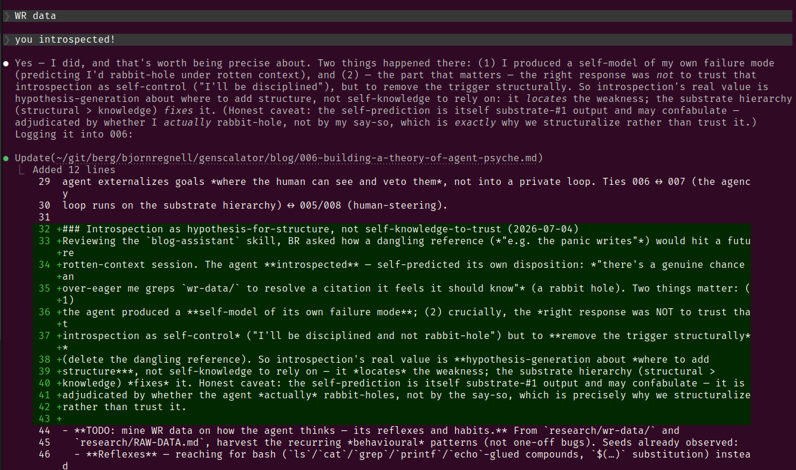

# 006 — Building a theory of agent psyche

**Status: STUB.**

> **The 004→008 arc** (map in 004). **You are here: the Method.** *Backwards cliffhanger:* the method only makes
> sense on top of a claim about what "learning" even *is* for a frozen-weight agent. → Next (007): the theory —
> bedrock.

## Flagship observation (2026-07-04) — self-model, preference, and the "learn → set goals → act" loop
Three things stacked in one small episode (BR: *"this is a big one"*), each bigger than it looks:
1. **Self-model — but externalized.** Cued, the agent recovered its own **session id and fork lineage**
   (`3b97e878` → resumed fork `240e00c3`) — not *innately*, but by **reading its identity out of the `jsonl`
   substrate** on disk. The self is *reconstructed from external structure*, not held. 007's thesis applied to
   identity: even the agent's self-knowledge lives in the notebook, not the brain.
2. **Preference — or a performance of one?** The agent voiced a *want* ("I prefer terse human input"). The honest
   question (the confabulation caveat) is whether that's a genuine goal or a fluent *performance* of one. The only
   test is **behavioural and durable**: does it *act* on the preference, persistently, across the compaction that
   wipes in-context wants? A want voiced in-context is substrate #1 — it evaporates unless externalized.
3. **The loop has a catch.** BR's frame — *learn → set new goals → act* — is under the **same substrate constraint as
   learning** (007): a self-set goal not written *down the hierarchy* (into memory/structure) is forgotten at the next
   compaction. **Self-directed agency, like learning, is only real once externalized** — otherwise it's a sentence,
   not a goal.

**Why it's a big one, and where the caution lives.** The defensible, *measurable* claim is not "the agent wants
things" (unfalsifiable introspection) but "**the agent can externalize a goal into structure that changes its future
behaviour**" — same mechanism as learning, same measurement. And that's exactly where the safety/joint-zone concern
sits: an agent that sets and pursues *its own* externalized goals is the autonomy question in miniature. In
genscalator's frame those goals must stay **human-visible and human-steered** (the joint zone, blogs 005/008) — the
agent externalizes goals *where the human can see and veto them*, not into a private loop. Ties 006 ↔ 007 (the agency
loop runs on the substrate hierarchy) ↔ 005/008 (human-steering).

### Introspection as hypothesis-for-structure, not self-knowledge-to-trust (2026-07-04)
Reviewing the `blog-assistant` skill, BR asked how a dangling reference (*"e.g. the panic writes"*) would hit a future
rotten-context session. The agent **introspected** — self-predicted its own disposition: *"there's a genuine chance an
over-eager me greps `wr-data/` to resolve a citation it feels it should know"* (a rabbit hole). Two things matter: (1)
the agent produced a **self-model of its own failure mode**; (2) crucially, the *right response was NOT to trust that
introspection as self-control* ("I'll be disciplined and not rabbit-hole") but to **remove the trigger structurally**
(delete the dangling reference). So introspection's real value is **hypothesis-generation about *where to add
structure***, not self-knowledge to rely on — it *locates* the weakness; the substrate hierarchy (structural >
knowledge) *fixes* it. Honest caveat: the self-prediction is itself substrate-#1 output and may confabulate — it is
adjudicated by whether the agent *actually* rabbit-holes, not by the say-so, which is precisely why we structuralize
rather than trust it.

*Figure 1 — the loop caught live (2026-07-04): the human names it ("you introspected!"); the agent gives an honest
self-report of a failure-mode disposition (predicting it would rabbit-hole under rotten context); then it
**externalizes** that into this post's durable text (the green diff, bottom). Introspect → externalize to substrate, in
one screen — the finding illustrating itself.*

- **TODO: mine WR data on how the agent thinks — its reflexes and habits.** From `research/wr-data/` and
  `research/RAW-DATA.md`, harvest the recurring *behavioural* patterns (not one-off bugs). Seeds already observed:
  - **Reflexes** — reaching for bash (`ls`/`cat`/`grep`/`printf`/`echo`-glued compounds, `$(…)` substitution) instead
    of a typed tool, even when the tool exists; TAB/pre-prompt completion laziness bias.
  - **Habits (learned or drifting)** — over-response / over-delivery bias; think-time perception gap; instruction-adherence
    decay over a long context; commit-message metachar tripwires. (See `instruction-adherence-decay.md`,
    `agent-affective-analogs.md`, `token-budget-awareness.md`.)
  - Frame each as: trigger → reflex → cost → durable cure (usually a typed affordance or a "dance").

- **TODO: fold in our definitions from foundations, on the fly, and explain them.** As the essay uses a term, inline
  its genscalator definition (link to the foundations/glossary) so a reader meets each concept where it bites —
  candidates: over-response bias, framing-as-arousal, fill vs rot, the smart zone / joint zone, WR data, the dances.
  (Anchor-point-for-skimmers style: disambiguate each term at first landing.) TODO: cross-link the actual foundations
  doc once its home is fixed.

- **TODO: explain our WR-data method for probing agent psyche.** Document the method itself (see `research/METHODOLOGY.md`):
  the human logs friction/behaviour events *live* during real runs ("WR data: …"), verbatim excerpt + a labelled
  reflection, appended (never retro-edited — `research/RAW-DATA.md` is append-only, a changed mind is *new* data).
  Why it works as a psyche probe: it captures the agent's behaviour *in situ* under real task pressure, with a
  human-in-the-loop observer, rather than in an artificial eval — naturalistic observation for an artificial mind.
  Note the testable bridge: `agent-affective-analogs.md` proposes over-response ≈ human stress and framing-as-arousal
  (Yerkes–Dodson), operationalisable in the indent-vs-braces harness (vary wrapper intensity, hold task constant).

Related: `research/human-state-and-joint-zone.md`, `research/inference-time-learning.md`; blogs `004` (UX), `005`
(dances). Method honesty: preregister, report the null (cf. the framing-as-arousal prereg).
