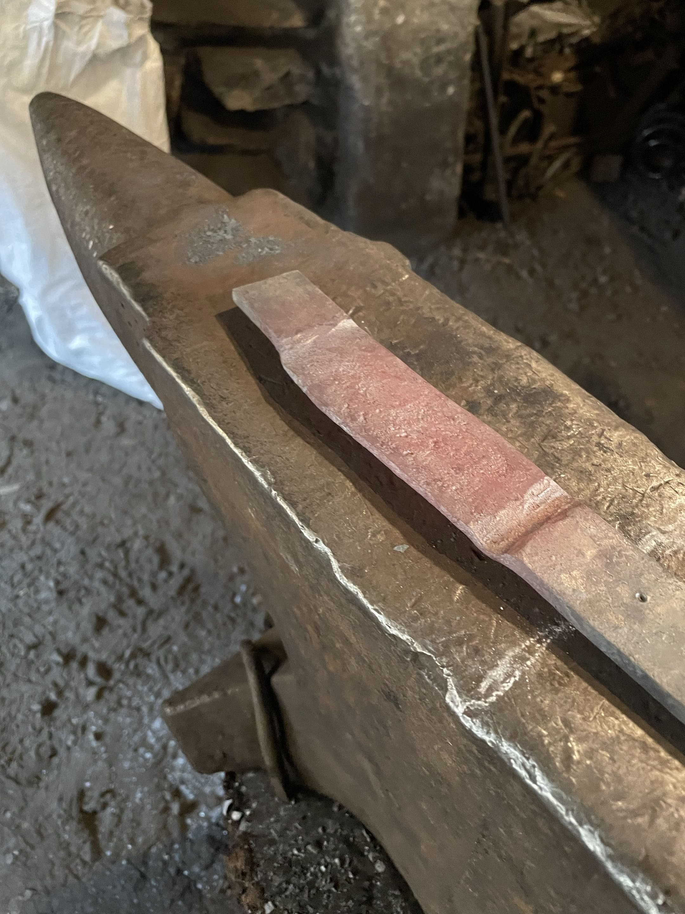

# Blacksmiths also bootstrap

<!-- Slug/number 029. STUB, not drafted. Theme: bootstrapping — a smith forges their own tools to forge the
     work; genscalator builds tools to build the tool. -->

> **Status: STUB 2026-07-18 (seed + TODOs only; nothing drafted yet).**
> **Audience:** TBD — likely agentic-SE practitioners + anyone who likes the bootstrapping story.

<!-- The failed axe, embedded so BR sees it and remembers the beat when he opens this draft. -->

*Above: axe-0. A failed axe. Kept in `img/` but pulled from the landing carousel.*

## Raw note (dumped verbatim, BR 2026-07-18)

> axe-0 wife says was a failed axe (she knows a real blcaksmith can tell..)  so take that out of crousel  (img stays in img but we dont use it for now (it was as buggy as bloop) )

## TODOs

- **TODO:** spin on axe-0 is a buggy axe prototype that needs to be thrown away.
- **TODO:** you need to build your tools to build your tool.
