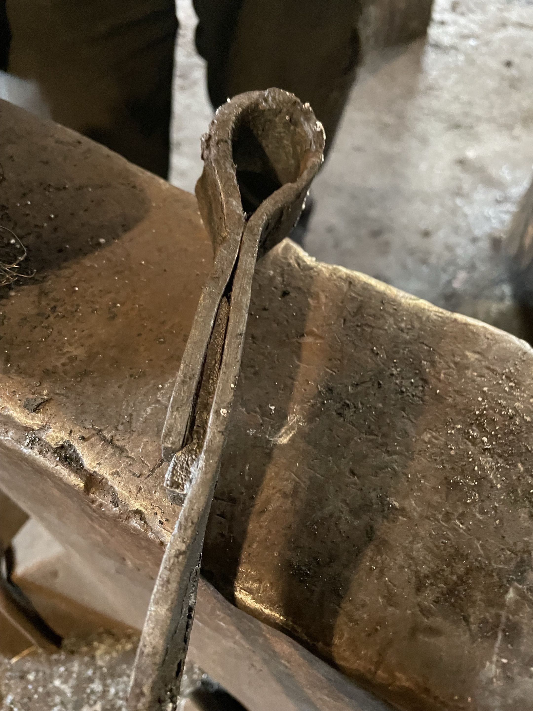

# Blacksmiths also bootstrap

<!-- Slug/number 029. SCAFFOLD: agent-populated beyond the seed 2026-07-19 (AFK solo run), for BR's rewrite.
     Everything below is raw material in service of BR's voice and review, not finished prose. Beats marked
     [scaffold] are the agent's proposed angle; BR keeps, rewrites, or cuts. Theme: bootstrapping - a smith
     forges her own tools to forge the work; genscalator builds tools to build the tool. -->

> **Status: SCAFFOLD 2026-07-19 (agent-populated from the 07-18 seed; not drafted in BR's voice yet).**
> **Audience:** agentic-SE practitioners + anyone who likes a bootstrapping story. (Proposed; TBD.)

*Above: a real axe, hand-forged by Susanne R. She forged it with tools she had forged herself.*

## The beat, in one line [scaffold]

You need to build your tools to build your tool - and a failed prototype is part of how.

## Section sketch 1 - the smith [scaffold]

The photos on the genscalator landing page are not stock images. They show real blacksmith work by
Susanne R, and the detail that earns this post: **she forged the axe with tools she had forged
herself.** Hammer and tongs first, then the axe. The tool chain starts with making the tool chain.
That is bootstrapping, centuries before software.

## Section sketch 2 - the failed axe [scaffold]

*Above: axe-0. A failed axe. Kept in `img/`, pulled from the landing carousel.*

To an untrained eye, axe-0 looks like an axe. It took a real blacksmith one glance to say it is a
failed one. Two things worth keeping from that:

- **A finished surface is not a working interior.** Only expert judgment - or a test that bites -
  tells them apart. (For software: the compiler and the test suite are the blacksmith's glance;
  prose review is the untrained eye.) [scaffold - this bridges to the typed-tools thesis; BR may
  prefer to keep the post lighter and cut it]
- **Prototypes fail, and that is the process working.** axe-0 was not published to the carousel,
  and it was not deleted either: it stays in `img/` as an honest record. Buggy prototypes get
  thrown out of the product, not out of history.

## Raw note (dumped verbatim, BR 2026-07-18)

> axe-0 wife says was a failed axe (she knows a real blcaksmith can tell..)  so take that out of crousel  (img stays in img but we dont use it for now (it was as buggy as bloop) )

## Section sketch 3 - genscalator bootstraps the same way [scaffold]

The software side of the same story, every item checkable in the repo:

- `tt newtool` is a typed tool whose job is to scaffold the **next** typed tool.
- This blog is rendered by `tt ssg` and previewed with `tt serv` - the toolbox publishes the posts
  that describe the toolbox (the manual says so about itself: `docs/manual-src/index.md`).
- The guard that watches the agent's shell commands (`tt guardcheck`) is itself a `tt` tool: the
  toolbox guards the building of the toolbox.
- And the forge has its own axe-0 moments: a packaged binary that looked finished and died at first
  real use is recorded in the pin board (the cold-claude fallback-image episode, 2026-07-19) - the
  buggy prototype thrown away, the lesson kept. [scaffold - one-home rule: keep the STORY here,
  point at the PB/SM146 addendum for the facts; do not restate numbers]

## The so-what [scaffold]

Forging your own tools is not vanity or nostalgia. It is how you get tools that fit your hand -
and a chain of custody for trusting them: you know what your hammer can do because you made it.
The genscalator claim is the same claim: an agent works better and safer with a small toolbox it
(and you) can inspect down to the metal, than with a borrowed shed full of sharp strangers.

## Further Reading [scaffold - links to verify before publish, per the echt rule]

- Bootstrapping (the general concept) - Wikipedia. **[link not yet verified - added AFK without
  network; verify it resolves and is on-topic before publish]**
- The genscalator landing page (the photos + the credit line): https://bjornregnell.se/genscalator/

## TODOs

- **TODO (BR):** rewrite the [scaffold] sections in own voice; decide whether sketch 2's
  compiler-bridge stays or the post remains a light photo-story.
- **TODO (BR):** does Susanne want her craft described in more detail (what tools she forged
  first)? A sentence from the smith herself would be the most echt line in the post.
- **TODO:** verify the Further Reading links; consider a figure of `tt newtool` scaffolding a tool
  (a real terminal capture, not staged).
- ~~TODO: spin on axe-0 is a buggy axe prototype that needs to be thrown away.~~ (folded into sketch 2)
- ~~TODO: you need to build your tools to build your tool.~~ (folded into the one-liner + sketch 3)
