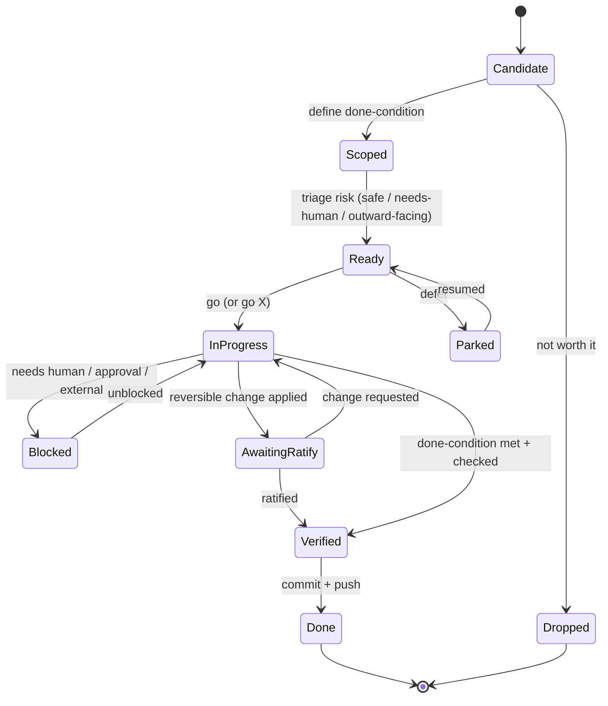

# Defining an agent task-state model

- **Question:** what are the **states an ongoing agent task moves through**, and the transitions between them — so the
  agent (and human) share one vocabulary for "where is this task?" instead of ad-hoc labels like `[safe]` / `[gated]` /
  `[deferred]` that leak out per session?
- **Why it matters:** these labels already showed up unbidden (BR spotted them in an AFK report, 2026-07-05). A named
  state model makes the **AFK dance** cleaner (the menu = tasks in `Candidate`/`Ready`), makes triage explicit (the
  `go X` verbs move tasks between states), and gives the **pinboard** a consistent shape. It's the backbone under
  *task-autonomy negotiation* (ballgame ↔ ralph) and the AFK-menu admission test.
- **Status:** **STUB** (agent-drafted 2026-07-05). Initial state set + diagram below; needs BR steer on the states
  and names. **Pinned as an AFK candidate:** *"think about the task-state model + refine this diagram."*
- **Plan:** iterate the diagram from real use; check it covers every task we actually run; then decide if it graduates
  into a `foundations.md` glossary entry + a `tt` helper that tags pinboard items by state.

## Candidate state set (v0 — for review)

| state | meaning | who moves it |
|---|---|---|
| **Candidate** | nominated, on the AFK/backlog menu; not yet scoped enough to act | agent nominates (always-stocked-menu invariant) |
| **Scoped** | defined well enough to act; has a clear done-condition | human or agent |
| **Ready** | scoped **and triaged** by risk → `safe` \| `needs-human` \| `outward-facing` (the AFK-job admission test) | agent proposes, human confirms |
| **InProgress** | actively being worked | agent |
| **Blocked** | awaiting a human decision / approval / an external event | agent flags, human (or world) unblocks |
| **AwaitingRatify** | agent applied a reversible change; human review pending (not a hard gate) | agent → human |
| **Verified** | done-condition met + checked (compiles / tests / behaviour) | agent |
| **Done** | committed + pushed + verified; nothing left to owe | agent |
| **Parked** | deliberately deferred (someday / after another milestone) | human or agent |
| **Dropped** | abandoned (no longer worth doing) | human or agent |

## State diagram (v0)

## Notes / open questions
- Is **AwaitingRatify** a real state or just a flavour of **Blocked**? (Lean: separate — it's *non-blocking* review,
  the work continues; Blocked *halts*.)
- The `go X` verbs (see `go-verb-vocabulary.md`) are essentially **named transitions** — e.g. `go stub` = *→ create a
  Candidate/Scoped note*, `go sweep` = *run a consistency dance*, `go pin` = *persist to substrate*. Worth aligning the
  verb set to the transitions once both stabilise.
- Does the AFK menu need to show each item's **state** (Candidate vs Ready vs Parked)? Probably — it's the admission
  filter.
- Graduation: if this holds, a `tt` tool could tag/track pinboard items by state (the pinboard as a small state
  machine), and a `foundations.md` glossary entry ("Task state model") would define it.
