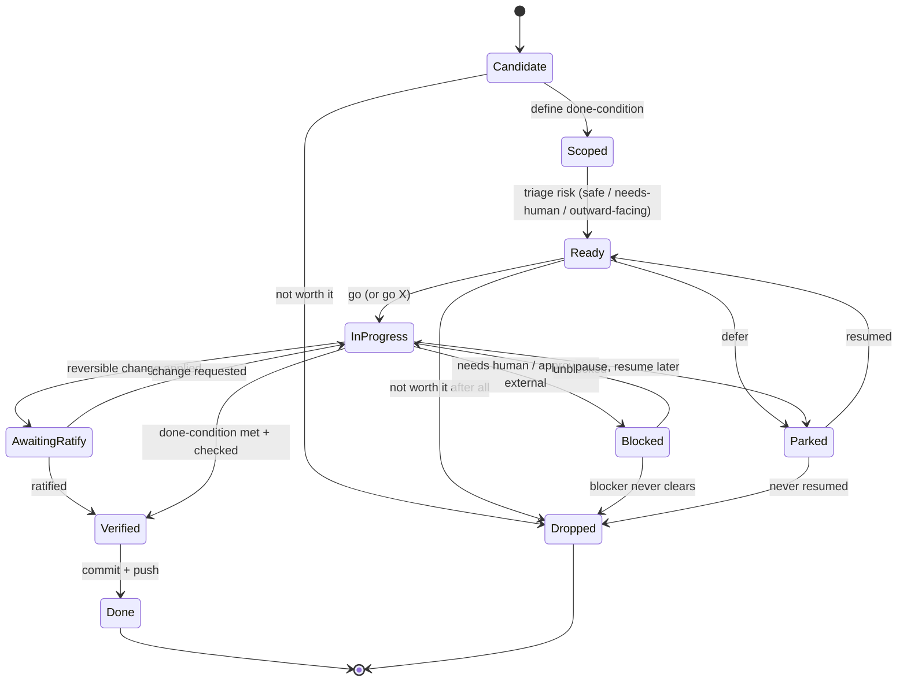

# Defining an agent task-state model

- **Question:** what are the **states an ongoing agent task moves through**, and the transitions between them — so the
  agent (and human) share one vocabulary for "where is this task?" instead of ad-hoc labels like `[safe]` / `[gated]` /
  `[deferred]` that leak out per session?
- **Why it matters:** these labels already showed up unbidden (BR spotted them in an AFK report, 2026-07-05). A named
  state model makes the **AFK dance** cleaner (the menu = tasks in `Candidate`/`Ready`), makes triage explicit (the
  `go X` verbs move tasks between states), and gives the **pinboard** a consistent shape. It's the backbone under
  *task-autonomy negotiation* (ballgame ↔ ralph) and the AFK-menu admission test.
- **Status:** **DRAFT v0.1** (agent-drafted 2026-07-05, agent-refined same day in a solo AFK pass: resolved the
  AwaitingRatify/Blocked question, added the realistic Drop/Park transitions, added a coverage check against real
  tasks). Still **needs BR steer on the state *names*** before any graduation. **Pinned as an AFK candidate.**
- **Plan:** iterate the diagram from real use; check it covers every task we actually run; then decide if it graduates
  into a `foundations.md` glossary entry + a `tt` helper that tags pinboard items by state.

## Candidate state set (v0 — for review)

| state | meaning | who moves it |
|---|---|---|
| **Candidate** | nominated, on the AFK/backlog menu; not yet scoped enough to act | agent nominates (always-stocked-menu invariant) |
| **Scoped** | defined well enough to act; has a clear done-condition | human or agent |
| **Ready** | scoped **and triaged** by risk → `safe` \| `needs-human` \| `outward-facing` (the AFK-job admission test) | agent proposes, human confirms |
| **InProgress** | actively being worked | agent |
| **Blocked** | awaiting a human decision / approval / an external event | agent flags, human (or world) unblocks |
| **AwaitingRatify** | agent applied a reversible change; human review pending (not a hard gate) | agent → human |
| **Verified** | done-condition met + checked (compiles / tests / behaviour) | agent |
| **Done** | committed + pushed + verified; nothing left to owe | agent |
| **Parked** | deliberately deferred (someday / after another milestone) | human or agent |
| **Dropped** | abandoned (no longer worth doing) | human or agent |

## State diagram (v0)

## Coverage check (real tasks, 2026-07-05 AFK pass)

Walking actual tasks from this session through the model — the test of "does it cover every task we run?":

- **The `svg` sequence-diagram tool.** BR nominated it mid-message (`Candidate`) → I scoped a done-condition,
  compiles + tests + a real figure (`Scoped`) → triaged `safe`, solo-buildable (`Ready`) → built it
  (`InProgress`) → 51+12 tests green + figure renders (`Verified`) → committed + pushed `85be745` (`Done`).
  Clean single path, no Blocked, no Ratify gate needed (I own the code decision). **Fits.**
- **This very note (task-state refine).** `Ready` → `InProgress` → applied a reversible edit → **`AwaitingRatify`**
  (BR reviews the state *names*; the work didn't halt — I kept going on other items). This is the canonical
  `AwaitingRatify` case: non-blocking review. **Fits, and validates the state's existence** (see below).
- **blog/010 Anthropic-Trump sources.** `Scoped` but **`Blocked`** — needs BR's exact settlement wording + a web
  verification I can't do prompt-free while AFK. Genuinely *halts*: I cannot proceed, so it is not merely awaiting
  ratify. **Fits — and is the clean contrast to AwaitingRatify.**
- **AFK-menu hygiene items (this pass: foundations sweep, blog link check, memory audit).** `Ready` (safe) →
  worked in turn. **Fit.**

No task in the session needed a state the model lacks; the additions above (Ready/Blocked/Parked → Dropped,
InProgress → Parked) came from asking "what *other* exits are real?" rather than from an observed gap.

## Notes / open questions
- **RESOLVED (proposed; BR to confirm): AwaitingRatify is a distinct state, not a flavour of Blocked.** The
  discriminator is **halt vs continue**: `Blocked` *halts* the task (the agent cannot proceed until a human/world
  event clears it — e.g. the 010 sources above); `AwaitingRatify` is **non-blocking** — a reversible change is
  already applied and working, the agent moves on, and the human's review is asynchronous (it may later request a
  change, sending it back to `InProgress`, or ratify it to `Verified`). Both this note and the 010 task above
  demonstrate the two live side by side in one session. Kept separate.
- The `go X` verbs (see `go-verb-vocabulary.md`) are essentially **named transitions** — e.g. `go stub` = *→ create a
  Candidate/Scoped note*, `go sweep` = *run a consistency dance*, `go pin` = *persist to substrate*. Worth aligning the
  verb set to the transitions once both stabilise.
- Does the AFK menu need to show each item's **state** (Candidate vs Ready vs Parked)? Probably — it's the admission
  filter.
- Graduation: if this holds, a `tt` tool could tag/track pinboard items by state (the pinboard as a small state
  machine), and a `foundations.md` glossary entry ("Task state model") would define it.
